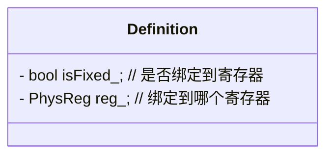

# ACO

ACO(AMD Compiler) 是针对 AMD 的 GCN/RDNA 架构 GPU 的 backend compiler。简单来说，ACO 将 NIR 形式的 shader 程序转换为 GCN/RDNA GPU 能够执行的二进制程序

[ACO README](https://gitlab.freedesktop.org/mesa/mesa/blob/main/src/amd/compiler/README.md)

## 概念

### SSA

在GPU编程中，SSA代表“Single Static Assignment”，即单静态赋值。这是一种编译器优化技术，主要用于简化代码分析和优化过程。

SSA的主要特点：

* 唯一赋值：每个变量只能被赋值一次。这意味着在SSA形式中，每个变量在程序的任何地方都只有一个定义（赋值）。
* 版本控制：为了处理多次赋值的情况，SSA引入了变量版本的概念。例如，如果一个变量 x 被赋值多次，那么这些赋值会被表示为 x1, x2, x3 等不同的版本。
* 简化分析：SSA形式简化了数据流分析和依赖分析，因为每个变量只有一个定义，这使得编译器可以更容易地确定变量的使用情况和生命周期。

在GPU编程中的应用：
在GPU编程中，SSA主要用于编译器优化阶段。通过将代码转换为SSA形式，编译器可以更容易地进行以下优化：

* 常量传播：确定哪些变量在编译时是常量，并将其替换为常量值。
* 死代码消除：删除那些不会影响程序结果的代码。
* 循环优化：分析和优化循环结构，以提高性能。

### CSSA

在GPU编程和编译器优化中，CSSA 通常指的是 Control-Flow Sensitive Static Single Assignment（控制流敏感静态单赋值形式），是一种用于编译器中间表示的高级优化技术。CSSA的主要目的是通过在控制流敏感的上下文中使用静态单赋值形式来简化编译器优化。

* 静态单赋值形式（SSA）

静态单赋值形式（Static Single Assignment, SSA）是一种程序表示形式，其中每个变量只被赋值一次。这种表示形式简化了编译器优化中的数据流分析和依赖关系管理，因为它消除了变量重定义的可能性。

* 控制流敏感（Control-Flow Sensitive）

控制流敏感优化是指在优化过程中考虑程序的控制流结构（如分支、循环等）。通过在控制流敏感的上下文中应用静态单赋值形式，编译器可以更精确地理解和优化程序的行为。

CSSA的含义和作用

* 程序局部化：CSSA通过将程序表示为静态单赋值形式，并结合控制流信息，使编译器能够更容易地进行局部化优化，如常量传播、死代码消除、强度消减等。
* 数据依赖关系分析：SSA形式有助于清晰地表示数据依赖关系，使得编译器能够更有效地进行寄存器分配、指令调度等操作。
* 控制流分析：CSSA允许编译器在考虑程序控制流的情况下进行优化，从而进一步提升程序的执行效率和安全性。

CSSA的应用场景

* 编译器优化：CSSA广泛应用于现代编译器中，作为高级优化阶段的一部分。它可以显著提升代码的执行效率和质量。
* GPU编程：在GPU编程中，CSSA可以帮助编译器更好地优化并行代码，例如在CUDA或OpenCL等环境中处理复杂的控制流和数据依赖关系。
程序分析：CSSA也被用于程序分析工具中，以提高分析的精确性和效率。

示例, 考虑以下简单的C代码：

```c
void example(int x, int y) {
    int a = x + y;
    if (x > 0) {
        a = x * y;
    }
    int b = a + 1;
}
```

在CSSA形式下，这段代码将被表示为静态单赋值形式，并考虑控制流信息。具体来说，a 的定义将根据控制流被分割成多个版本，例如：

```c
void example(int x, int y) {
    int a1 = x + y;
    if (x > 0) {
        int a2 = x * y;
        int b = a2 + 1;
    } else {
        int b = a1 + 1;
    }
}
```

通过这种方式，编译器可以更清楚地看到变量的定义和使用，从而进行更精确的优化。

### CSE

在GPU编程中，CSE 代表 Common Subexpression Elimination（公共子表达式消除）。这是一种编译器优化技术，旨在通过识别和消除重复的子表达式来提高代码的执行效率。

CSE的主要概念： 在编程中，有时同一个表达式可能会被多次计算，而其结果实际上是相同的。通过识别这些重复的计算，编译器可以只计算一次并将结果存储在临时变量中，从而避免不必要的重复计算。

```c
int c = a * b + b * a;
```

在这个例子中，表达式 a * b 和 b * a 是相同的（因为乘法具有交换性），因此可以被优化。编译器可以引入一个临时变量来存储 a * b 的结果，从而避免重复计算。优化后的代码可能类似于：

```c
int a = 5;
int b = 10;
int temp = a * b;
int c = temp + temp;
```

CSE在GPU编程中的重要性：

* 性能提升：通过消除重复计算，减少了不必要的指令执行，从而提高了代码的执行效率。
* 资源优化：减少了计算资源的占用，这对于资源受限的GPU环境尤为重要。
* 代码简化：有时消除公共子表达式还可以简化代码，使得后续的优化和分析更加容易。

编译器中的CSE： CSE通常作为编译器的一个优化步骤，在编译过程中自动应用。现代GPU编程环境和编译器（如CUDA编译器nvcc）通常会包含CSE优化，以提高生成的GPU代码的性能。

### VGPR

在GPU编程中，VGPR 代表 Vector General-Purpose Register（向量通用寄存器）。VGPR是GPU上的一种寄存器类型，用于存储和处理向量数据。

VGPR的含义和用途：

* 向量数据处理：VGPR主要用于存储和处理向量数据，其中每个寄存器可以存储多个数据元素（例如，32位或64位浮点数）。这使得VGPR非常适合用于并行计算，如SIMD（单指令多数据）操作。
* 通用寄存器：VGPR不仅限于特定的数据类型，可以用于存储各种向量数据，包括整数、浮点数、布尔值等。
* 寄存器数量有限：与CPU相比，GPU的寄存器数量有限，特别是在每个线程使用的寄存器数量上。因此，有效地管理和使用VGPR对于优化GPU程序的性能至关重要。

VGPR的组织和使用：

* SIMD宽度：VGPR通常组织成固定宽度的向量，例如在AMD GCN（Graphics Core Next）架构中，每个VGPR包含四个32位浮点数或整数。
* 线程寄存器分配：在GPU计算中，每个线程都有自己独立的一组寄存器。寄存器的使用会影响每个线程的执行效率和GPU的资源管理。
* 寄存器压力：当程序需要大量VGPR时，可能会导致寄存器压力，进而影响线程的并发执行。编译器和开发者需要平衡寄存器的使用，以最大化性能。

VGPR与性能优化：

* 寄存器分配：编译器会尝试将频繁使用的变量分配到寄存器中，以减少内存访问延迟。VGPR的分配和使用策略对程序性能有显著影响。
* 寄存器溢出：当线程需要的寄存器数量超过可用VGPR数量时，编译器可能会将寄存器溢出到堆栈或局部内存，这会增加延迟并降低性能。
* 优化提示：开发者可以通过编译器选项或代码结构调整来影响VGPR的使用，例如通过减少循环嵌套或使用局部变量来优化寄存器分配。

### linear VGPR

在GPU编程中，linear VGPR 是指以线性方式访问向量通用寄存器（VGPR，Vector General-Purpose Register）的一种模式或方法。具体来说，linear VGPR通常与在着色器或内核中对寄存器进行线性索引或访问有关，特别是在处理内存或数组数据时。

Linear VGPR 的含义：

* 线性访问：Linear VGPR通常指的是在向量寄存器中进行线性（连续）的访问或索引。例如，当你访问一个数组时，你可以通过一个线性索引来访问不同的寄存器位置。
* 寄存器文件的线性视图：在某些GPU架构中，VGPR可以被视为一个线性寄存器文件，开发者可以通过计算出的线性索引访问特定的寄存器，而不是通过固定的寄存器名称或编号。这意味着编译器或程序员可以使用计算出来的偏移量对寄存器进行动态访问。
* 优化场景：在某些情况下，编译器或开发者可能希望将分散的寄存器访问转换为连续的线性访问，以提高内存访问的效率或简化指令生成。

Linear VGPR 的应用场景：

* 数组处理：当处理大型数组或数据块时，linear VGPR允许通过计算出的索引动态访问不同的寄存器。例如，如果你有一个向量数组，你可以使用一个索引变量来访问数组的不同元素，而不需要为每个元素手动指定寄存器。
* 循环展开：在某些优化场景中，如循环展开（loop unrolling），linear VGPR可以帮助简化寄存器分配，使多个迭代的计算能够更有效地并行执行。
* 寄存器压力管理：通过线性访问寄存器，可以更好地管理寄存器资源，特别是在资源受限的GPU环境中。通过减少不必要的寄存器使用，可以提高整体并行性和性能。

示例：

假设你在一个GPU内核中需要处理一个大小为4的数组，你可以通过linear VGPR来访问这些寄存器：

```c
// 假设你有一个大小为4的数组，使用线性索引来访问VGPR
__kernel void example_kernel(__global float* input, __global float* output) {
    int index = get_global_id(0);

    // 使用线性索引来访问寄存器
    float4 reg;
    reg.x = input[index + 0];
    reg.y = input[index + 1];
    reg.z = input[index + 2];
    reg.w = input[index + 3];

    // 输出结果
    output[index] = reg.x + reg.y + reg.z + reg.w;
}
```

在这个例子中，reg 是一个float4类型的向量寄存器（VGPR），通过线性索引index来访问连续的内存位置。这就是linear VGPR的一种典型应用场景。

Linear VGPR 与 非线性 VGPR：

* Linear VGPR：通过线性索引或偏移来访问寄存器，通常用于连续数据的处理，如数组或向量操作。
* 非线性 VGPR：寄存器的访问方式不是线性的，可能是通过非连续索引或随机访问寄存器。这种方式可能在一些复杂算法或稀疏数据结构中使用。

### SIMD

SIMD 代表 Single Instruction, Multiple Data（单指令多数据），是一种计算机处理器的并行计算模式。SIMD允许一条指令同时对多个数据点执行相同的操作，从而显著提高数据级并行（Data-Level Parallelism, DLP）的处理能力。

SIMD的核心概念：

* 单指令：CPU执行一条指令。
* 多数据：同一条指令作用于多个数据元素。

SIMD的工作原理：

* 向量化：在SIMD模式下，数据通常以向量形式存储，这些向量可以包含多个数据元素。例如，一个32位的寄存器可以存储4个8位整数或2个16位整数。
* 并行处理：同一条指令可以同时对向量中的所有数据元素执行相同的操作。例如，一条加法指令可以同时对两个向量中的四个整数进行加法运算。

SIMD的优势：

* 性能提升：通过并行处理多个数据元素，SIMD可以显著提高某些计算密集型任务（如图形处理、科学计算、金融分析等）的性能。
* 效率高：由于减少了指令的数量和数据传输的开销，SIMD可以更高效地利用CPU资源。

SIMD的实现方式：

* 硬件支持：现代CPU通常内置了SIMD指令集扩展，如Intel的SSE（Streaming SIMD Extensions）、AVX（Advanced Vector Extensions），以及ARM的NEON。
* 编程接口：开发者可以使用特定的SIMD指令集来编写高效的并行代码。例如，在C/C++中，可以通过使用内置函数或编译器扩展来利用SIMD指令。

示例：

```c
void add_arrays(float* a, float* b, float* result, int n) { for (int i = 0; i < n; i++) {
        result[i] = a[i] + b[i];
    }
}
```

在没有SIMD的情况下，这个循环会逐个元素进行加法运算。如果使用SIMD指令（例如SSE），可以同时对多个元素进行加法运算，例如：

```c
// _mm_loadu_ps、_mm_add_ps 和 _mm_storeu_ps 是SSE指令
// 用于加载、加法和存储4个浮点数。
void add_arrays_simd(float* a, float* b, float* result, int n) {
    int i;
    for (i = 0; i + 3 < n; i += 4) {
        __m128 va = _mm_loadu_ps(&a[i]);
        __m128 vb = _mm_loadu_ps(&b[i]);
        __m128 vresult = _mm_add_ps(va, vb);
        _mm_storeu_ps(&result[i], vresult);
    }
    // Handle remaining elements
    for (; i < n; i++) {
        result[i] = a[i] + b[i];
    }
}
```

### ILP

在GPU编程以及计算架构的领域中，ILP 代表 Instruction Level Parallelism（指令级并行性）。ILP是一个重要的概念，它描述了在一个处理器中，同时执行多条指令的能力，以提高计算性能。

ILP的核心概念

* 指令并行性：ILP允许在同一个时钟周期内执行多条不相互依赖的指令。这意味着CPU或GPU可以通过并行处理来提高吞吐量。
* 硬件支持：ILP的实现依赖于处理器的设计，包括流水线（Pipelining）、超标量（Superscalar）执行和动态调度等硬件特性。这些设计使处理器能够在执行过程中有效地利用闲置的功能单元。
* 依赖关系：指令间的依赖关系会限制ILP。如果指令之间存在数据依赖（如第二条指令依赖于第一条指令的结果），则不能并行执行。因此，ILP的优化策略通常会关注如何减少这些依赖关系。

ILP的类型

* 静态ILP：由编译器在编译阶段分析和生成能够并行执行的指令序列。编译器会对代码进行优化，以减少指令之间的依赖。
* 动态ILP：由处理器在运行时动态识别和调度指令。现代处理器通常结合使用动态调度技术，以便在运行过程中决定何时可以发射指令。

GPU中的ILP

在GPU编程中，ILP也发挥着重要作用。现代GPU架构设计了数百甚至数千个处理单元，可以在同一时刻处理大量的线程。GPU通过以下方式利用ILP：

* 多线程架构：GPU能够在多个线程之间切换，隐藏内存延迟。这种上下文切换使得即使某些线程因数据依赖而暂停，GPU仍然能够继续执行其他线程，从而实现更高的整体吞吐量。
* SIMD 指令：GPU通常采用单指令多数据（SIMD）架构，在一条指令下并行处理多个数据元素。通过这种方式，不同数据的操作可以在一个时钟周期内同时完成，发挥了ILP的优势。
* 任务细分：程序被细分为许多小任务，这些小任务通常会有较少的依赖关系，从而能够更容易地实现指令级并行性。

### φ节点（phi node）

在GPU编程和一般的编译器技术中，φ节点（phi node）是静态单赋值（Static Single Assignment，SSA）形式中的一个重要概念。它主要用于处理控制流中的变量赋值和选择，以便于在编译过程中进行优化。以下是关于φ节点的详细解释：

φ节点的基本概念

* 目的：在SSA表示中，φ节点用于解决不同控制流路径（例如分支语句）中，相同变量的不同赋值的问题。当程序有多个执行路径，变量可能会在这些路径上被赋予不同的值，φ节点则用来根据控制流选择正确的值。
* 形式：φ节点通常在中间代码中表示为一个特殊的函数，形如： $x = φ(a, b)$，这里，x是变量，a和b则是来自不同控制流路径的值。使用φ节点的目的是在执行到该点时，根据控制流的实际走向选择a或b作为x的值。

使用场景

* 控制流分析：编译器使用φ节点来维护变量在控制流图（Control Flow Graph, CFG）中的状态。这允许同一变量在不同分支中被重新赋值而不产生冲突。
* 优化编译：通过引入φ节点，编译器可以使用SSA形式来优化代码，执行诸如常量传播、死代码消除和循环优化等操作。

示例，考虑以下代码片段：

```c
if (condition) {
    x = 1;
} else {
    x = 2;
}
y = x + 3;
```

在未使用SSA形式的代码中，变量x可能在两个不同的控制流路径中被赋予不同的值。使用φ节点，我们可以将这段代码表示为：

```c
x1 = 1;                  // 来自条件为true的路径
x2 = 2;                  // 来自条件为false的路径
x = φ(x1, x2);          // 根据条件选择x1或x2
y = x + 3;
```

在这里，x的值会在多个路径中通过φ节点进行选择。执行时，如果condition为真，则x取x1的值（即1）；如果为假，则取x2（即2）。

进一步的作用

* 影响寄存器分配：φ节点的引入使得在寄存器分配阶段，编译器可以更清晰地识别变量的不同存储值，从而优化寄存器的使用。
* 影响后续优化：在进行后续的优化时，比如在死代码消除（Dead Code Elimination）阶段，φ节点帮助识别哪些变量可以被安全地去除，而不会影响程序的输出。

### NOP

在GPU编程和计算机体系结构中，NOP 是指 No Operation（无操作）指令。NOP 指令是一种特殊的指令，它实际上不执行任何操作，但它在代码中有几个重要的应用和作用。

NOP的基本概念

* 定义：NOP 指令在程序执行时不会改变寄存器的状态或内存的内容。执行完 NOP 指令后，程序的状态保持不变。
* 表现形式：在不同的编程环境或汇编语言中，NOP 指令的表示方式可能有所不同。例如： 在 x86 汇编中，NOP 通常用 NOP 表示（其机器码为 0x90）。 在一些其它架构中，可能会有不同的表示方式。

NOP的应用场景

* 占位符：在某些情况下，开发者可能会使用 NOP 指令作为占位符。这在程序调试期间或需要留出特定空间的情况下尤其有用。
* 同步和延迟：NOP 指令可以用于控制指令的执行周期。在多线程或并行计算中，NOP 可以用来延迟某些操作，以确保其他操作先行完成。例如，在GPU编程中，可能需要在某个线程中插入一条 NOP 指令，以确保某些数据在其他线程处理之前可用。
* 控制流的跳转：在控制流中，NOP 可以用于调试，以确保某些指令在特定情况下不会被执行。例如，在添加跳转逻辑的过程中，有时需要在跳转位置占用空间，以保持代码的逻辑结构。
* 避免指令重排序：在一些体系结构中，为了优化性能，编译器或处理器可能会对指令进行重排序。插入 NOP 指令可以防止某些关键操作的重排序，从而维护程序的正确性。
* 性能优化：在内存访问延迟较大的架构中，可以插入 NOP 指令来填充处理器的空闲时间，从而提高整体执行效率。这种做法在某些情况下可能会改善指令流水线的效率。

示例，假设有以下代码段用于GPU中的线程同步：

```c
// 线程A
do_something();
NOP; // 等待其他线程完成某些操作
do_another_thing();
在上述代码中，NOP 指令并不改变任何状态，但可以用于确保在 do_something() 和 do_another_thing() 之间留出一个周期，以避免由于处理速度不同而引起的竞态条件或状态不一致。
```

### NP-complete problem

NP-complete problem（NP完全问题）是一个在计算理论中非常重要的概念，属于复杂性理论的范畴。这个概念的目的是描述一类特别困难的问题，这些问题在理论上是高效的算法难以解决的。以下是关于NP完全问题的详细解释：

基本概念

* NP问题：NP代表“非确定性多项式时间”（Nondeterministic Polynomial time）。一个问题是NP问题，如果可以在多项式时间内（例如O(n^k)）验证一个给定的解是否正确，其中n是输入规模，k是常数。
示例：图的着色问题。给定一个图和一个着色方案，可以很容易地验证每一个节点是否都满足颜色限制。
* NP完全问题：NP完全问题是NP问题中最难的一类问题。这些问题有一个特殊的性质：如果任何一个NP完全问题可以在多项式时间内解决（即存在多项式时间算法），那么所有NP问题都可以在多项式时间内解决。
示例：旅行商问题（TSP）、布尔可满足性问题（SAT）。

核心特征

* 多项式时间可验证性：对于NP完全问题，给定一个潜在的解，可以在多项式时间内验证该解是否正确。
* 硬度：NP完全问题是目前为止理论上最难的问题。如果不存在多项式时间算法，这表明它们在实际应用中难以高效解决。
* 归约性：NP完全问题之间可以相互归约。也就是说，如果一个NP完全问题可以在多项式时间内解决，那么其他的NP完全问题也都可以。

历史背景

* Cook-Levin定理：在1971年，Stephen Cook和Leonid Levin分别独立证明了NP完全问题的存在。Cook的工作特别重要，因为他证明了任何一个NP问题都可以在多项式时间内归约到SAT问题。
* 著名的NP问题：许多人尝试证明或反驳P = NP的猜想（即是否存在多项式时间算法来解决所有NP问题），但至今未有定论。

典型例子

* 布尔可满足性问题（SAT）：给定一个布尔表达式，是否存在一组变量赋值使得表达式为真。
* 旅行商问题（TSP）：给定一组城市和每对城市之间的距离，求解访问每个城市一次并返回起始城市的最短路径。
* 图的顶点覆盖问题：给定一个图和一个整数k，是否存在一个大小为k的顶点集合，使得图中的每条边都至少有一个端点在集合中。

解决NP完全问题的策略

* 启发式算法：通过经验和近似方法来寻找相对较好的解，但不保证最优解。
* 近似算法：提供一种方法，保证解的近似比，但不能保证多项式时间。
* 分支限界法：通过搜索空间剪枝策略，尝试在有限时间内找到最优解。

### Barrier

在GPU编程中，barrier（或称为内存屏障、同步屏障）是一个用于控制并行线程执行的同步原语。它的主要作用是确保在并行计算过程中，某些线程在执行到某个点时必须等待其他线程到达同一个点，才能继续执行。换句话说，barrier保证了所有线程在继续执行后续代码之前，都达到了同一个同步点。

详细解释：

1. 线程同步: GPU编程通常涉及大量并行线程的执行。在某些情况下，不同线程可能会执行不同的任务，但在某些关键点上，它们需要彼此之间进行同步。例如，某个线程可能需要等待其他线程完成一部分计算，才能继续自己的计算。barrier提供了一种机制来实现这种同步。
2. 局部同步与全局同步:
    * 局部同步：通常是指在同一个线程块（block）或线程组内的线程之间的同步。例如，在CUDA编程中，__syncthreads() 是一个常用的barrier，它确保线程块中的所有线程在继续执行之前都到达该调用点。
    * 全局同步：有时需要在不同线程块之间进行同步，这在一些GPU编程模型中比较复杂，因为不同的线程块可能在不同的处理单元上并行执行。全局同步通常需要使用更高级别的同步机制或特定的硬件支持。
3. 数据一致性: Barrier还可以保证内存中的数据一致性。例如，在CUDA中，__syncthreads()不仅同步线程，还确保所有线程在同步点之前的内存写入操作是可见的。这对于避免数据竞争和确保计算的正确性非常重要。

使用场景：

* Tile算法：在一些矩阵计算或图形处理算法中，线程块内的线程往往需要协作完成一个子任务，在计算的某个阶段，线程之间可能需要交换数据或确保计算一致性。这时就需要使用barrier来同步线程。
* Reduction操作：例如在并行计算中进行归约（reduction）操作时，线程可能需要先局部归约，然后同步，再进行全局归约。同步点就需要使用barrier。

### DPP8 / DPP16

在GPU编程中，DPP8和DPP16通常指的是数据并行处理（Data Parallel Processing）中的数据打包格式或处理方式。具体来说：

* DPP8：DPP8中的"DPP"代表Data Parallel Processing，"8"则表示每个线程处理8位（1字节）的数据。DPP8通常用于处理8位整数数据，例如在图像处理或机器学习推理过程中，这种格式可以有效地打包和处理多个8位数据点。

* DPP16：类似地，DPP16中的"16"表示每个线程处理16位（2字节）的数据。DPP16用于处理16位整数或半精度浮点数（FP16）数据。在需要更高精度或动态范围的情况下，DPP16比DPP8更合适。

这些术语常见于GPU的SIMT（Single Instruction, Multiple Threads）架构中，尤其是AMD的GCN（Graphics Core Next）架构。在这些架构中，DPP允许在单个指令下并行处理多个数据点，从而提高计算效率。

### SDWA

在GPU编程中，SDWA代表Single Data Word Atomic (单数据字原子操作)。这是一种用于优化数据传输和操作的技术，特别是在AMD的GCN（Graphics Core Next）架构中使用。SDWA技术允许在单个线程中对单个数据字（通常是32位）进行原子操作，而不需要复杂的硬件锁或同步机制。

SDWA的主要特点和用途包括：

* 优化性能：通过减少同步和锁的需求，SDWA可以显著提高某些类型操作的性能，尤其是在需要频繁进行原子操作的场景中。
* 简化编程：对于开发者来说，使用SDWA可以简化代码，因为它不需要处理复杂的同步机制，使得代码更易于编写和维护。
* 数据传输优化：SDWA还优化了数据在内存和寄存器之间的传输效率，进一步提升了整体性能。

在AMD的GPU编程中，开发者可以使用SDWA来优化需要高性能原子操作的应用程序，尤其是在图形处理、科学计算和机器学习等需要大量数据并行操作的领域。

### Reduction

在GPU编程中，reduction（规约）是一种常见的并行计算操作，主要用于将一个数据集合通过某种二元操作（例如加法、乘法、最大值、最小值等）合并成一个单一的结果。规约操作通常用于求和、求最大值、求最小值、求平均值等场景。

具体操作过程：

1. 输入数据集合：假设我们有一个包含 N 个元素的数组，每个线程可以处理其中一个或多个元素。
2. 并行处理：每个线程先并行处理自己负责的那部分数据。比如，如果要做加法规约，每个线程会将自己负责的那部分数据相加。
3. 逐步合并：由于最终目标是将所有数据合并成一个单一的结果，因此需要多个步骤来合并线程之间的结果。这通常涉及将部分结果逐步合并到全局结果中。
4. 最终结果：经过几次迭代合并操作后，最终可以得到整个数据集合的规约结果。

常见的规约操作：

* 求和（Sum）：将所有元素相加，得到一个总和。
* 最大值（Max）：找出数据集合中的最大元素。
* 最小值（Min）：找出数据集合中的最小元素。
* 乘积（Product）：将所有元素相乘，得到总乘积。
* 逻辑与/或（AND/OR）：对所有元素执行逻辑与或逻辑或操作。

并行规约的挑战

在GPU上实现规约操作时，主要挑战在于如何高效地协调大量线程协同工作。由于GPU拥有数千个并发线程，因此需要设计合理的并行算法，以确保这些线程能够快速、有效地合并中间结果。

常见的并行规约策略：

* 分治法（Divide and Conquer）：将数据分成多个块，每个块由一组线程并行处理，然后递归地将部分结果合并，直到得到最终结果。
* 树形规约（Tree Reduction）：类似于分治法，但通过构建一棵树来合并结果，每个线程先处理局部数据，然后逐层向上合并结果，类似于构建一棵“树”的过程。
* 分块规约（Block Reduction）：每个线程块先计算自己的局部结果，然后由一个特定的线程块继续处理这些局部结果，直到得到最终结果。

### Divergence Analysis

在GPU编程中，**divergence analysis（分支发散分析）**是一个重要的概念，主要用于理解和优化GPU内核（kernel）中的分支指令。分支发散指的是在执行过程中，同一波前（wavefront）或线程块（thread block）中的不同线程由于条件判断（如if-else语句）而执行不同的代码路径，导致线程间的执行路径不再一致。

分支发散的定义: 在一个波前或线程块中，如果某些线程执行某一分支路径，而其他线程执行不同的分支路径，则发生了分支发散。分支发散通常由条件语句（如if、else、switch等）引起。

分支发散会显著影响GPU的性能，因为：

* 串行执行：在发生分支发散的情况下，原本可以并行执行的线程会被迫串行执行不同的代码路径，降低了并行效率。
* 额外开销：GPU需要维护多个执行路径，并在后续阶段重新同步这些线程，这会增加额外的开销和延迟。

分支发散分析的目的

1. 识别分支发散：通过分析内核代码，识别哪些地方可能发生分支发散。
2. 优化代码：通过重构代码或使用特定的编程技巧，减少或消除分支发散，从而提高并行效率。

常见的分支发散优化技巧

* 减少条件语句：尽量减少内核代码中的条件语句数量，特别是那些可能导致明显分支发散的条件语句。
* 合并条件：将多个条件合并，使得更多线程可以走同一路径。例如，使用&&或||合并多个条件。
* 使用掩码：在某些情况下，可以使用掩码（mask）来控制线程的执行路径，而不使用显式的条件语句。
* 向量化：在某些架构中，使用向量化指令可以减少分支发散，因为向量化指令可以在同一指令周期内处理多个数据点。

分支发散分析工具

* NVIDIA Nsight Compute：NVIDIA提供的一个强大的分析工具，可以用来分析和可视化CUDA内核的分支发散情况。
* AMD Radeon Developer Tools：AMD提供的一组工具，可以用来分析和优化GPU内核中的分支发散。

### GDS / LDS

在 GPU 编程的 GFX 规范中，GDS（Global Data Share）和 LDS（Local Data Share）是两种不同的内存区域，用于在 GPU 计算单元（CU）内或跨计算单元共享数据。它们的主要区别在于作用范围和使用方式。

1. LDS（Local Data Share）
    * 作用范围：LDS 是一种局部内存，只在单个计算单元（CU）或一个工作组（Workgroup）内共享。
    * 用途：LDS 通常用于存储工作组内所有线程共享的数据。由于它是局部内存，访问速度非常快，适合用于频繁读写的场景，例如共享数据的中间结果存储。
    * 特点：LDS 的容量相对较小，通常为几 KB 到几十 KB，但访问延迟很低。
2. GDS（Global Data Share）
    * 作用范围：GDS 是一种全局内存，可以跨多个计算单元（CU）或工作组（Workgroup）共享数据。
    * 用途：GDS 用于需要在多个工作组之间共享的数据。由于其全局特性，GDS 的访问速度比 LDS 慢，但它的作用范围更广。
    * 特点：GDS 的容量通常比 LDS 大得多，可以达到几百 KB 甚至更大，但访问延迟相对较高。

### dword

dword是一个数据类型，表示“双字”（Double Word）即一个 **32位** 的整数，相当于4个字节。
在C/C++语言中，dword通常被定义为一个无符号整数类型（unsigned int），因为它通常用于表示颜色的RGBA分量、纹理坐标或其他需要32位无符号整数的场合。
在使用HLSL（High-Level Shader Language）或GLSL（OpenGL Shading Language）进行GPU编程时，dword 可能不是直接使用的数据类型，但你会在一些文档或代码中看到它被提及，因为它在底层的数据传输和处理中非常重要。

## Data Structure

### Definition



## Control Flow

* GPU 是并行执行 shader 程序的 SIMD
* GCN/RDNA 是 several waves(each has 32/64 lanes) 方式执行的，如果所有 lane 执行相同的指令，即走相同的分支路径，叫做 **uniform control flow**；如果有 lanes 走不同分支路径，叫做 **divergent**
* 每条 hardware lane 对应一个软件唤起的 shader 程序
* hardware 并不支持 divergence，在 divergent control flow 中 GPU 会运行所有路径，但运行某条路径时会 disable 其他使用相同数据的 lanes，因此优化 divergence 在 shader 编程中特别重要
* ACO 通过 两个 CFG 处理 divergent control flow:

```yml
logical CFG: 直接从 NIR 转换而来，走程序计划的控制流
linear CFG:
    - 使用 Whole-Function Vectorization 算法创建
    - 表示程序如何在物理层面被 GPU 执行
    - 为避免 critical edges 可能会包含多余的 blocks
    - 也包含 logical CFG
```

## Compilation Phases

编译过程包括一下这些阶段:

### Instruction Selection

Instruction Selection 基于 divergence analysis 并在 NIR shader 中分 3 步:

1. divergence analysis pass 为每个 SSA definition 计算其是否在所有线程中是 **uniform** 的，即所有线程该值相同
2. 为 SSA 确定 register class
3. 确定最终的 instruction selection。优秀的 divergence analysis 可以更好的利用 scalar unit, scalar memory loads and scalar register file

有两种类型的 instruction:

1. GCN/RDNA 架构手册中定义的 **hardware instruction**
2. 封装 hardware instruction 指令的 pseudo instruction，最终会被转换为更底层的 hardware instruction

每种 instruction 包含 operands(读取的 temporaries) 和 definitions(写出的 temporaries)。temporaries 可以固定到指定的 register 或者指定一个 register class(a single register or a vector of several registers)

### Value Numbering

即对每个变量值进行编号，原因如下:

1. NIR 中没有 descriptor load representation
2. NIR 指令包含多条 ACO 指令，可能要做 CSE，会做 dominator-tree value numbering

### Optimization

在这一阶段，简单的指令会被组合为复杂指令，如不同版本的 multiply-add, neg, abs, clamp output modifiers 等，并且常量被内联。具体如何优化取决于当前编译的 shader 要运行的 hardware

### Setup of reduction temporaries

为了确保用于 reductions 目的的 register allocation 正确，需要添加使用了 linear VGPRs 的 pseudo 指令。当 temporary 包含一个 linear VGPR register class 时，意味着这个变量 live in the linear control flow graph

### Insert exec mask

GCN/RDNA 架构中有一个特殊的寄存器名为 **exec**，这个寄存器用于手动控制哪些 VALU threads(aka. lanes) 是 active 的。exec 的值在 divergent branches, loops 中需要经常改变，并且在其执行完后需要被 restored

### Live-Variable Analysis

live-variable analysis 用于计算 shader 需要用到的 register，该信息被用来在 register allocation 之前进行 spilling 和 scheduling

### Spilling

首先将着色器程序转换为 CSSA 形式，然后，如果寄存器需求超出了 global limit，通过以下方式减少寄存器占用: 将超出的 scalar values in free vector registers 或 vector values 临时存储到 scratch memory 中，需要用到的时候在加载

### Instruction Scheduling

指令调用是一个 NP-complete 问题，由于寄存器压力的不可预测性, 启发式算法并不好用。因此 ACO 中的 scheduler 并不会 completely re-schedule 所有指令，而是聚焦于在不超出 maximum register limit for the pre-calculated wave count 的情况下 move up memory loads。原因是 GCN 中 ILP is very limited

### Register Allocation

register allocator 基于 SSA 特性工作。SSA 属性保证总是有足够多的寄存器可用。有一个问题是一些指令需要 a vector of neighboring register 可用，但 free regs 可能比较分散。在这种情况下 register allocator 插入一段 shuffle code(将一些 temporaries 移动到其他 registers) 来使这段空间可用。设计思路是 a few more moves 一般总是好过 sacrifice a wave。使用 RA(Randomized Algorithm / 随机算法) 来进行 SSA-reconstruction，runtime 是线性的

### SSA Elimination

通过在 blocks 结尾插入 parallelcopies 来 match phi nodes 语义

### Lower to HW instructions

大多数 pseudo instructions 被转换为 actual machine instructions。这些大多数是通过 instruction selection or register allocation and spill/reload code 创建的 parallel copy instructions

### ILP Scheduling

该调度器通过 register 而不是 SSA-values 来确定依赖关系。它实现了一种基于每次处理少量指令的局部依赖图(partial dependency graph) 的 forward list scheduling 算法，旨在创建更大的内存子句(memory clauses) 并提高 ILP

### Insert wait states

GCN 需要手动插入一些 wait states 来保证 memory instructions 和一些 register dependencies 正常工作。即通过插入 **s_waitcnt** 指令(and its variants) 来使 shader program 等待，直到 memory operation 等操作完成

### Resolve hazards and insert NOPs

有些指令需要等待状态或其他指令来解决硬件无法处理的危险(hazard)，这一步确保没有一致的危险发生，等待操作等过插入 NOPs 来实现

### Emit program - Assembler

汇编器(Assembler)生成将发送到硬件执行的实际二进制代码。ACO 的汇编器很简单明了，因为所有指令的格式、操作码(opcode)、寄存器(register)和潜在字段(potential fields)都已经准备好，需要做的只是处理硬件之间的一些差异

## Supported shader stages

硬件各个阶段(hardware stages as executed on the chip) 并非完全对应软件阶段(software stages as defined in OpenGL / Vulkan)。哪个软件阶段在哪个硬件阶段执行取决于当前 pipeline 中存在哪些软件阶段。

一个重要的不同点是在软件模型(SW models)中 VS 总是第一个要运行的阶段，而在 GCN/RDNA 的术语中，HW VS 是指在片段着色器(fragment shading)之前的最后一个硬件阶段(HW stage)。这就是为什么当使用细分或几何着色(tessellation or geometry shading)时，HW VS 不再用于执行 SW VS。

**Glossary of software stages**

```yml
VS : Vertex Shader
TCS: Tessellation Control Shader, equivalent to D3D HS = Hull Shader
TES: Tessellation Evaluation Shader, equivalent to D3D DS = Domain Shader
GS : Geometry Shader
FS : Fragment Shader, equivalent to D3D PS = Pixel Shader
CS : Compute Shader
TS : Task Shader
MS : Mesh Shader
```

**Glossary of hardware stages**

```yml
LS : Local Shader (merged into HS on GFX9+), only runs SW VS when tessellation is used
HS : Hull Shader, the HW equivalent of a Tessellation Control Shader, runs before the fixed function hardware performs tessellation
ES : Export Shader (merged into GS on GFX9+), if there is a GS in the SW pipeline, the preceding stage (ie. SW VS or SW TES) always has to run on this HW stage
GS : Geometry Shader, also known as legacy GS
VS : Vertex Shader, not equivalent to SW VS: when there is a GS in the SW pipeline this stage runs a "GS copy" shader, otherwise it always runs the SW stage before FS
NGG: Next Generation Geometry, a new hardware stage that replaces legacy HW GS and HW VS on RDNA GPUs
PS : Pixel Shader, the HW equivalent to SW FS
CS : Compute Shader
```

### HW 和 SW 阶段对应关系

#### Mesh Shading Graphics Pipeline

```yml
LDS: Local Data Store/Share, 也常被称为 Shared Memory(共享内存)
    - 是 GPU 架构中一种特殊的内存区域
    - 用于同一个工作组(work-group)内的多个工作项(work-items)或线程之间共享数据
    - 它在提高并行计算性能方面起着至关重要的作用，尤其是在需要频繁交换数据的算法中
PC : a special ring buffer called Parameter Cache
```

* SW TS 在 HW TS 阶段运行并且输出到 VRAM
* SW MS 在 HW NCG 阶段运行，从 VARM 获取输入并输出到 LDS, PC
* SW FS 在 HW PS 阶段运行，从 LDS, PC 获取输入

|GFX10.3+ HW stages     |CS |NCG |PS |ACO terminology
|- |- |- |- |-
|SW stages: only MS+PS: |   |MS  |FS |mesh_ngg, fragment_fs
|            with task: |TS |MS  |FS |task_cs, mesh_ngg, fragment_fs

#### Compute Pipeline

* SW CS 总是在 HW CS 阶段运行

|GFX6-10 HW stage |CS |ACO terminology
|- |- |-
|SW stage         |CS |compute_cs

## How to Debug

```yml
RADV_DEBUG option:
ACO_DEBUG option:
```

```sh
# 指定选项
RADV_DEBUG=nocache,shaders ACO_DEBUG=validateir,validatera vkcube
```

## 源码

### 编译阶段对应源文件

|Compilation Phases |Source File
|- |-
|Instruction Selection              |aco_instruction_selection.cpp<br> aco_instruction_selection.h<br>aco_instruction_selection_setup.cpp
|Value Numbering                    |aco_opt_value_numbering.cpp<br>aco_dominance.cpp
|Optimization                       |aco_optimizer.cpp<br> aco_optimizer_postRA.cpp
|Setup of reduction temporaries     |aco_reduce_assign.cpp
|Insert exec mask                   |aco_insert_exec_mask.cpp
|Live-Variable Analysis             |aco_live_var_analysis.cpp
|Spilling                           |aco_spill.cpp
|Instruction Scheduling             |aco_scheduler.cpp
|Register Allocation                |aco_register_allocation.cpp
|SSA Elimination                    |aco_ssa_elimination.cpp<br>aco_lower_to_cssa.cpp<br>aco_reindex_ssa.cpp<br>aco_lower_phis.cpp
|Lower to HW instructions           |aco_lower_to_hw_instr.cpp
|ILP Scheduling                     |aco_scheduler_ilp.cpp<br>aco_form_hard_clauses.cpp
|Insert wait states                 |aco_insert_waitcnt.cpp
|Resolve hazards and insert NOPs    |aco_insert_NOPs.cpp
|Emit program - Assembler           |aco_assembler.cpp

其他源文件

```txt
aco_dead_code_analysis.cpp
aco_interface.cpp
aco_interface.h
aco_ir.cpp
aco_ir.h
aco_lower_subdword.cpp
aco_print_asm.cpp
aco_print_ir.cpp
aco_shader_info.h
aco_statistics.cpp
aco_util.h
aco_validate.cpp
```
