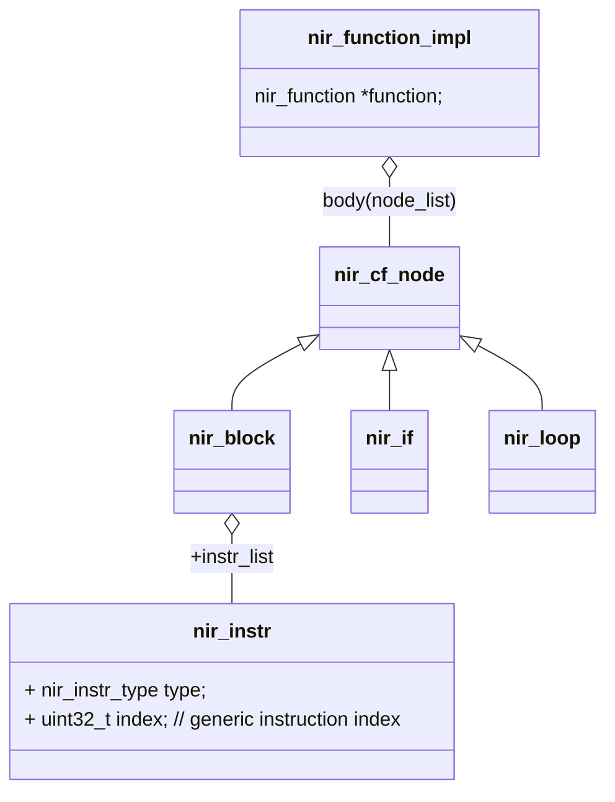
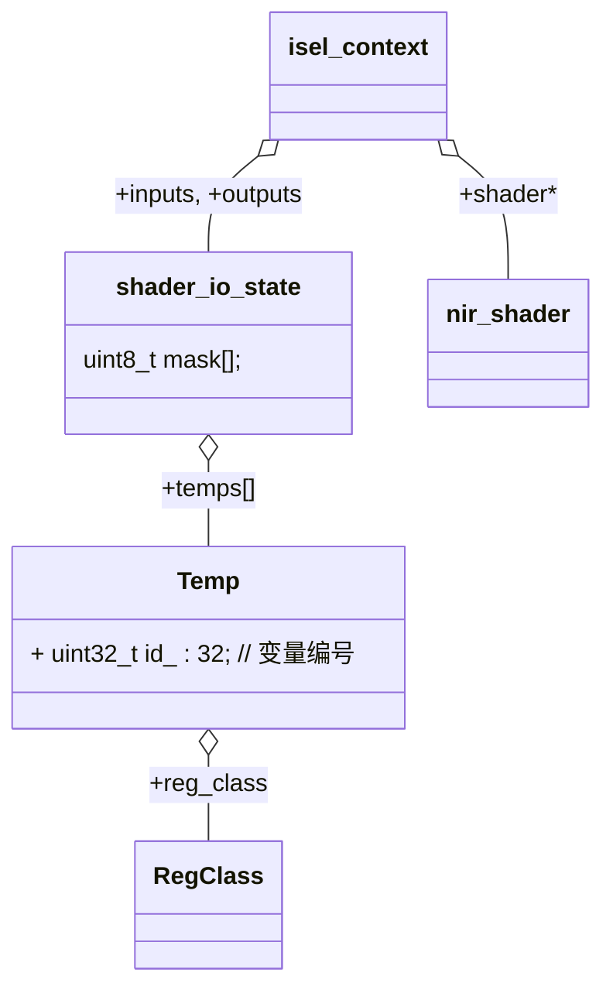
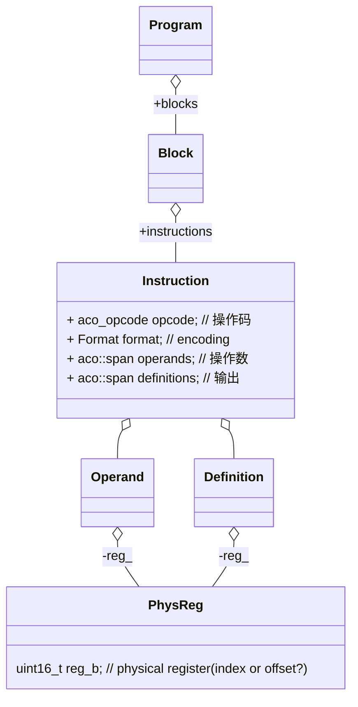
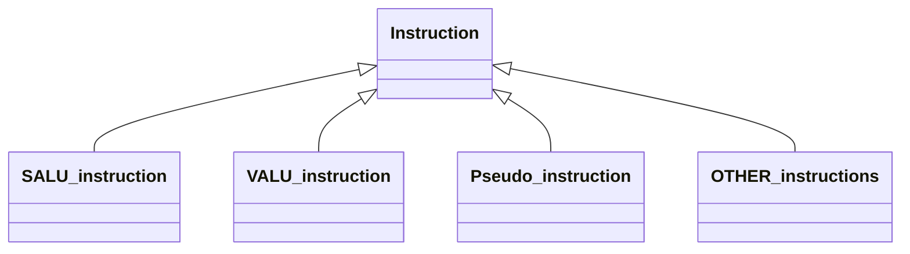
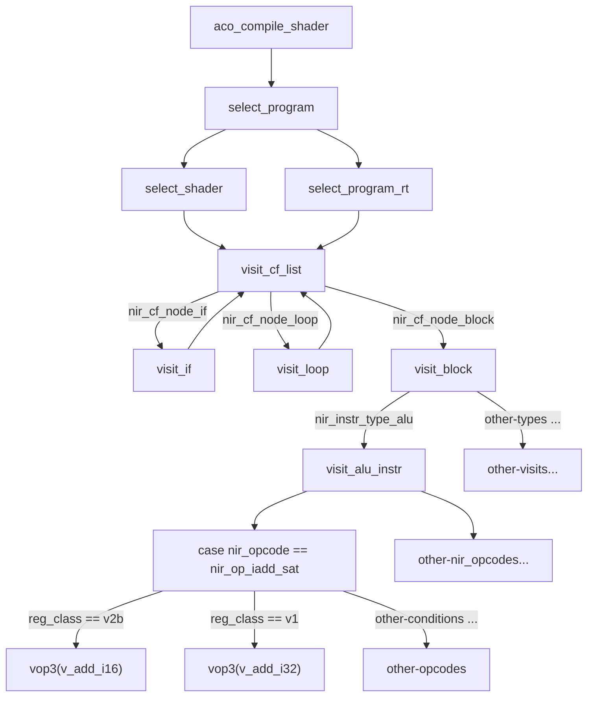
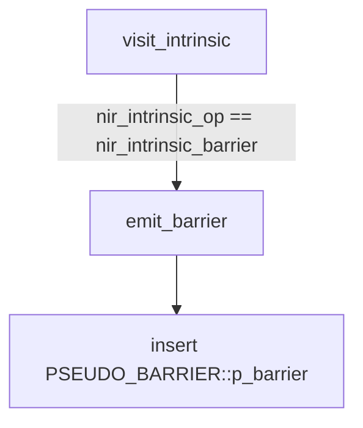
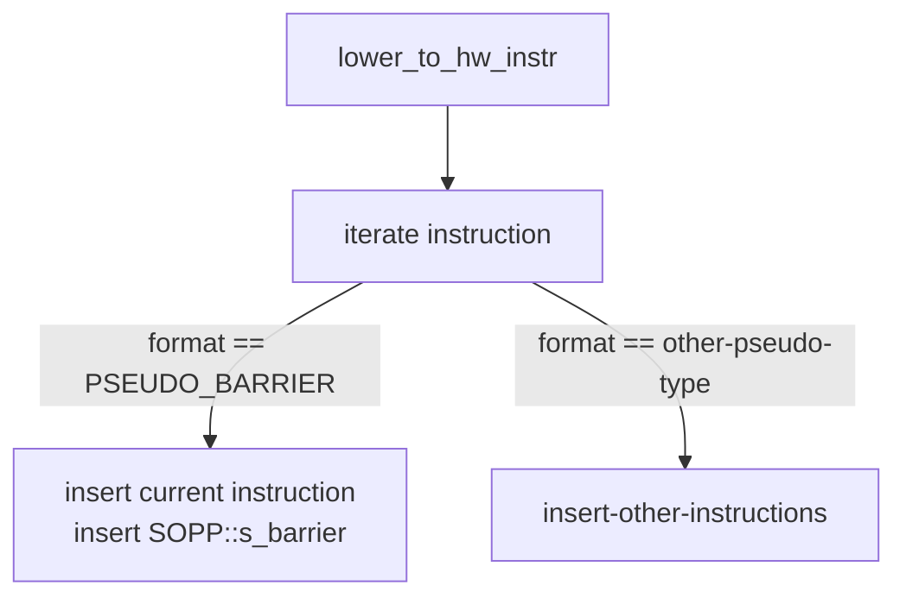

# Debug

[RenderDoc](https://renderdoc.org)

```sh
# 编译时需要删除 shader 缓存，否则不会重新编译
rm -rf ~/.cache/mesa_shader_cache_db
# 函数调用栈
glCompileShader ->
_mesa_CompileShader ->
_mesa_compile_shader ->
_mesa_glsl_compile_shader
```

```c
// AMD GFX 版本
enum amd_family:amd_gfx_level;
// AMD 显卡型号
enum amd_family:radeon_family;
```

## Register

Physical Registers

|abbr |desc
|- |-
|V_FIX  |Vector
|S_FIX  |Scalar
|M_FIX  |M#
|EXEC   |Exec mask
|VCC    |Vector condition code
|SCC    |Scalar condition code

## NIR



## ACO







```c
Instruction* create_instruction(aco_opcode opcode, Format format, uint32_t num_operands, uint32_t num_definitions);
```

```c
// pseudo instructions lowed to machine instructions
void lower_to_hw_instr(Program* program);
```

## ACO Compilation

### Instruction Selection

Basic Instruction Selection Flow



### Value Numbering
### Optimization
### Setup of reduction temporaries
### Insert exec mask
### Live-Variable Analysis
### Spilling
### Instruction Scheduling
### Register Allocation
### SSA Elimination

### Lower to HW Instruction

生成伪指令



lower 伪指令



### ILP Scheduling
### Insert wait states
### Resolve hazards and insert NOPs

### Assembly

```sh
# 调用流程
radv_shader:radv_shader_nir_to_asm ->
radv_shader:shader_compile ->
aco_interface:aco_compile_shader ->
aco_assembler:emit_program ->
aco_assembler:emit_block ->
aco_assembler:emit_instruction(translate instructions into binary codes)
```

## Debug Status

ACO_DEBUG 环境变量可选值: aco_debug_options
AMD_DEBUG 环境变量可选值: radeonsi_debug_options

```cpp
// 在 si_fill_aco_options 函数中设置
// 需要 si_screen::debug_flags 开启
aco_compiler_options::dump_shader
```

### 安装 amd 反汇编程序

[github](https://github.com/CLRX/CLRX-mirror/releases)

## ACO 源码分析

### RegClass

RegClass 在 aco_ir.h 中定义，通过枚举设置类型

通过 is_subdword, bytes, size 函数分析各个枚举含义

```yml
s1,s2,s3,s4,s6,s8,s16: TODO
v1,v2,v3,v4: TODO
v5,v6,v7,v8: TODO
v1b,v2b,v3b,v4b,v6b,v8b: 是 dword 类型，分别表示 dword 到 dwordx8
v1_linear,v2_linear: linear VGPR
```

|RegClass |RegType |is_subdword |bytes |size
|- |- |- |- |-
|s1        |sgpr    |0  |4  |1
|s2        |sgpr    |0  |8  |2
|s3        |sgpr    |0  |12 |3
|s4        |sgpr    |0  |16 |4
|s6        |sgpr    |0  |24 |6
|s8        |sgpr    |0  |32 |8
|s16       |sgpr    |0  |64 |16
|v1        |vgpr    |0  |4  |1
|v2        |vgpr    |0  |8  |2
|v3        |vgpr    |0  |12 |3
|v4        |vgpr    |0  |16 |4
|v5        |vgpr    |0  |20 |5
|v6        |vgpr    |0  |24 |6
|v7        |vgpr    |0  |28 |7
|v8        |vgpr    |0  |32 |8
|v1b       |vgpr    |1  |1  |1
|v2b       |vgpr    |1  |2  |1
|v3b       |vgpr    |1  |3  |1
|v4b       |vgpr    |1  |4  |1
|v6b       |vgpr    |1  |6  |2
|v8b       |vgpr    |1  |8  |2
|v1_linear |vgpr    |0  |4  |1
|v2_linear |vgpr    |0  |8  |2
