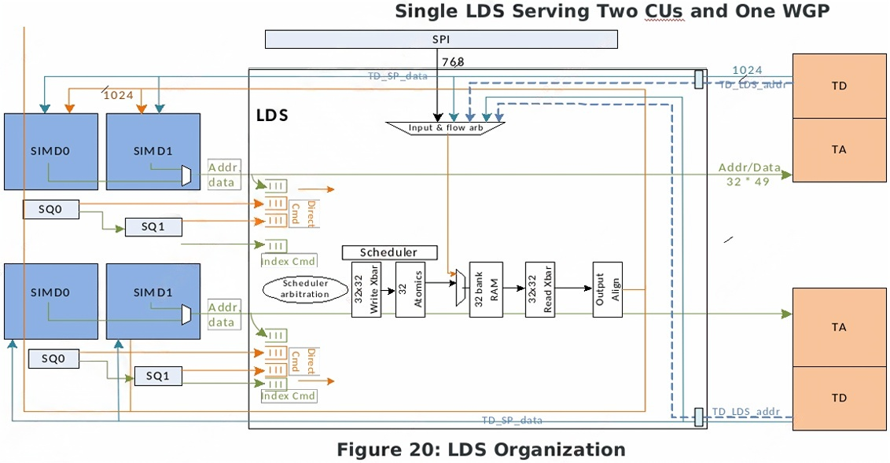

# Rendering Pipeline

## Abbr

|Abbr |Full |Desc
|- |- |-
|ACE    |Asynchronous Compute Engine    |Up to 4 of them in CPC
|AXI    |Advanced eXtensible Interface  |AMBA microbus component used in SoC
|CB     |Color Buffer or Blender        |Pixel Color blender and output
|CMM    |Cache Memory Management
|CP     |Command Processor              |Common unit for CPG, CPF and CPC
|CPF    |Command Processor Fetcher      |Data Fetch support
|CPG    |Command Processor Graphics     |Graphics support
|CPC    |Command Processor Compute      |Compute support containing ACE units
|CS     |Compute Shader                 |API shader Dx12/OpenCL/HSA
|CSG    |Compute Shader/Graphics Engine |=GCS, D3D Graphics/Compute shader Engine
|CU     |Compute Unit                   |An organization of compute resources that share a memory allocation in LDS for access by all the work items in a work group
|CH     |Central Hub                    |Graphics core central fabric hub
|DB     |Depth-Stencil Buffer block     |Pixel Depth-stencil test and output
|ES     |Export Shader                  |shader stage used for GS processing
|GC     |Graphics Core                  |corporate acronym for Graphics + Compute Engines
|GDS    |Global Data Share memory unit  |GPU memory module
|GE     |Geometry Engine                |Combines geometry fixed function support
|GEIA   |GE-IA
|GEWD   |GE-WD
|GESE   |GE-SE
|GFX    |Graphics
|GL     |OpenGL API format
|GL2    |Graphics Level2 Cache          |GPU L2 Data Caches in memory hierarchy
|GL1    |Graphics Level1 Cache          |GPU L1 Data Caches in memory hierarchy
|GPR    |General purpose registers      |vGPR and sGPR
|GPU    |Graphics Processing Unit
|GRBM   |Graphics Register Bus Manager  |public GFX hardware
|GS     |Geometry shader                |Common API geometry shader stage
|HQD    |Hardware Queue Descriptor      |Used by the CP block
|HS     |Hull shader                    |Common API surface shader stage
|IA     |Input Assembler                |Assembling vertex/primitive data
|IB     |Instruction Buffer             |Buffer to stage Instruction consumption(SQ, CP)
|IFPO   |Inter Frame Power Off          |Method to turn off the GPU in between frames to help save power
|IS     |Instruction Store              |Instruction prefetch buffer
|ISA    |Instruction Set Architecture   |CPU or GPU
|LDS    |Local Data Share
|LS     |Local Shader                   |Common public shader stage for patch control point processing
|ME     |Micro Engine                   |Internal RISC microprocessor in public
|MQD    |Memory Queue Descriptor        |Used by CP block
|NGG    |Next Generation Geometry
|PA     |Primitive Assembler            |Primitive Setup for rasterization
|PARAM  |Shader export type             |Export operation that writes data to fixed function parameter cache storage
|PBB    |Primitive Batch Binner         |Pre-Scan converter unit that traverses primitives multiple times in bin order
|PC*    |Parameter Cache*               |Dedicated memory unit in GPU pipeline
|PC     |Program Counter                |寄存器，指向当前正在执行指令的内存地址
|PFB    |Packet Filtering Block         |Discards redundant state updates and registers
|PFP    |PreFetch Parser                |CP first packet parser
|PM4    |public GPU packet              |Proprietary public packet
|POPS   |Primitive ordered Pixel Shading|A rendering method that allows shader access to Unordered Access
|PS     |Pixel Shader                   |Common API shader to process pixels
|PSR    |Pixel Staging registers        |Pre-shader launch storage of data to be loaded into pixel vGPRs
|RA     |Resource Arbiter               |Responsible for checking and selecting launching wavefront resources
|RB     |Render Backend block           |GPU depth and color processing blocks
|RLC    |Runtime Low-Power Controller   |Provides power and hypervisor controls of the GFX pipeline
|RLC    |Run-List Controller
|SA     |Shader Array                   |A collection of WGP that share a GL1
|SALU   |Scalar ALU                     |Operates in parallel with VALU
|SC     |Scan Converter                 |Geometry to pixel conversion block
|SCF    |Scan Converter Frontend        |Geometry to pixel conversion rasterizer
|SCB    |Scan Converter Backend         |Pixel unit that controls depth processing and packing of surviving quads for pixel waves
|SDMA   |System Direct Memory Access block|Standalone system DMA units for data movement
|SDF    |Scalable Data Fabric for SoC   |SOC15 component for on-chip communications
|SE     |Shader Engine                  |Complex of one or two shader arrays
|SH
|SIMD   |Signle Instruction Multiple Data
|SMEM   |Scalar memory operation        |Scalar unit memory access instruction
|SOG    |State Object Group             |PM4 packet for indirect state data load
|SPI    |Shader Pipe Input block        |Shader system input and tracking unit
|SQ     |Sequencer                      |Main unit for instruction scheduling in shader system
|SQC    |Sequencer Caches(I$ + D$)      |Contains both instruction $ and data $
|SQG    |Sequencer Global Unit          |Unit in SPI to execute thread trace and messages from the SQ in the SE
|SX     |Shader X-bar                   |Shader export X-bar to DB and CB
|TA     |Texture Address generation block|Texture address unit
|TCA
|TCC    |Texture Cache Channel          |a.k.a TC L2 or gL2
|TCP    |Texture Cache Pipe             |a.k.a vL1 or vL0
|TD     |Texture Data Path              |Texture data return and filter unit
|TF     |Tessellation Factors           |Patch Tessellation factors
|UTC    |Unified Translation Cache L0/L1/L2|Supports both CPU and GPU allocated pages
|VALU   |Vector ALU                     |ALU in SIMD unit
|VGT    |Vertex Grouper and Tessellator |public GFX hardware block
|VMEM   |Vector Memory operation        |ISA for Load/Store operations
|VMID   |Virtual Memory ID              |Container identifier for page table identification for process running on the GPU
|VS     |Vertex Shader                  |Common API vertex shader stage
|WD     |Work Distributor(replaced by GE functions)|Executes draw or dispatch commands form a graphics ring
|WGP    |Work Group Processor           |A MOBILE0 acronym for a collection of resources of two traditional CU to execute a work group of work items with a shared memory allocation. it is also designed to support a pair of CUs for CU mode of operation
|PH
|PC     |Parameter Cache
|BCI    |Barycentric Interpolator
|UTCL2  |Unified Translation Cache Level2       |Level2 address translation cache

## Concepts

### Wave, Wave32, Wave64

在GPU硬件设计中，"wave"（波）通常与"wavefront"（波前）相关，在AMD的GCN和RDNA架构中，"wave"等同于wavefront，是调度的最小单位。 GPU将wave作为整体调度到计算单元（CU）上执行。

* Wavefront是GPU调度和执行的基本单元，包含一组线程，通常是32(Wave32)或64(Wave64)个线程。
* 这些线程在SIMD（单指令多数据）单元上同步执行相同的指令，但处理不同的数据。wave中的线程在SIMD单元上同步执行，共享指令流但处理不同数据。遇到分支时，不同路径的线程会被串行处理，可能导致性能下降。每个wave独占一组寄存器，寄存器数量影响GPU的并行能力。wave中的线程通过合并内存访问提高效率。
* 每个计算单元可同时处理多个wave，通过切换隐藏延迟。

## Mariner Specification Parameters

```yml
SE: 1 SE
    SA: 1 SA per SE
        WGP: 3 per SA
            LDS: 64KB
            SIMD: 4 SIMD32, 16 Waves/SIMD
            CU: 2 per WGP
            TA
            DB
            TCP
                V$
            SQ
            SQC
                I$: Instruction Cache L0
                K$: Scalar(constant) Cache L0
        SC: with 3 RB+ for 24 Pixels per cycle/Shader Engine (32b)
            PBB
        RB: 3 Render-Backend
            DB
            CB
        GL1: 32KB * 4
        UTCL1
    SPI
    SX
    PA
GE
CP:
    CP instruction cache: 32KB (PFP, ME, MEC, CE)
PH
GDF: Graphics Data Fabric
GDS
SDMA
CH
UTCL2
GL2: 256KB * 4, 128B Lines
EA: Efficiency Arbiter
RLC

Parameter Cache Depth   : 512KB
SDMA engine(s)          : 1 (CP DMA)
```

### SE

A Shader Engine(SE) is the computational workhorse of the GPU. It consists of arrays of WGPs, L1 R/W cache complexes, pixel pipeline(PA, SC, SPI, SX and RBs), the backend of a geometry pipeline and inter stage parameter and position storage. An SE is loosely defined as all of the blocks associated with one SPI.

### SPI

The SPI receives work from three primary sources: Graphics-Compute Engines(GCS), Geometry Engines(GE), and Pixel Pipe(PP). For the pixel pipe, SPI includes generation of barycentric(I, J, W) values for the pixel wave inputs, and for the compute pipes, SPI is responsible for generating 3D(X, Y, Z) thread_id_in_group for each work item. The SPI includes data buffering for pixel and frontend types to stage and hold initial VGPR data for each of the shader stages. This includes information held in the vertex staging registers(VSR) such as vertex_index for VS of LS or ES, patch_id for HS, primid or vertex offset for GS, and information held in the pixel staging registers(PSR) such as I, J or screen X, Y.

The native graphics pipeline has a notion of "frontend ID". Effectively, the GE instances a native VGT for each prim/vert per clock targeted for a configuration. The VS work delivered to SPI in native mode is sent with an FE_ID dictating which PA eventually consumes the output of the data, and therefore which of 2 PA-specific position buffers are written by a given VS wave. SPI and SX acts as a crossbar for this native frontend work, allowing any VS wave to go out to any WGP within an SE while still getting their position output to the appropriate position buffer/PA.

SPI and SX act as crossbar for pixels. Each Scan Converter(SC) has 3 packers(SCB = packer) which own a region of the screen and are each associated with 3 RBs and an SX color buffer. The SPI can route pixels from any packer to any SIMD32, and the SX router returns those pixels to their associated RB. Since there are 3 packers driving an SPI and creating work for a single SE/SA, there are 3 PS wave types: PS, PS1, PS2.

The SPI manages the use of all shader resources. Each input type asserts a set of allocation request to resource management logic to determine if it would fit in some WGP resources. In general, the tasks that fit can be selected to input waves to the SA. When a task is selected, it allocates LDS, GPRs, scratch, wave slot, and barrier resources, then initializes GPRs and LDS, and the generates a new-wave command to get the waves running on a SIMD32 of a WGP. Each MOBILE0 SPI is capable of creating one new wavefront every cycle, regardless of W32 or W64 sizing, so long as shader resources are available, and the workload is not shader initialization rate(VGPR, SGPR, LDS) limited.

Each shader engine enables two wave launch controllers for concurrent operation. Each controller has the facilities to maintain 32 dwords VGPR load, 8 dwords of SGPR load. SPI also controls the LDS loads at a rate of 24 Dwords per clock. Fastest wave32 launch would be 1 cycle, typical pixel wave would be two clocks. Wave 64 takes twice the time to load.

The SPI also manages shader export buffer space for Color, Position, Parameter. Waves cannot export until the have SX space allocated. If a wave attempts to export before it has been allocated SX space, the wave goes to sleep until the alloc arrives. Sometime after a wave is created, the SPI sends an 'sx-alloc' message to the wave indicating that its SX space has been allocated and it is free to export.

As pixel or vertex shader waves finish processing, they may "export" final color, position, or vertex parameter data from VGPRs to the SX's export buffers or PC. The SPI is responsible for arbitrating the use of the shader export busses. The shader issues an export instruction which makes a request to SPI to use the export-data bus. SPI grants waves in priority order across export types(POS, COL, PARAM, GDS) and in age order within each type. When the wave receives the grant from SPI it reads the data from VGPRs and places it on the export bus. Waves should export data at that time without delay, so export-grants are the highest priority for reading VGPRs and does not stall. The SX maintains a color export buffer per packer and a position buffer per SA. The SPI and SX both manage export buffer space and scoreboards independently for the different color and position buffers and SPI enforces export rules of only one writer per col/pos destination per clock. The SX stores and assembles this information and eventually passes it on to the CB/DB for color, PA for position, or parameter cache for vertex parameters.

The Workgroup processor(WGP) is a level of grouping in MOBILE0. It is a collection of 4 SIMD32s which can cooperate on the work for one workgroup. It is similar to two Compute-Units(CUs) with the ability to communicate through a shared LDS. It contains an instruction and constant cache, four sequencers, 4 scalar units, 4 SIMD32 vector units, a shared memory(LDS) unit, two texture address and filter units and two GL0 cache.


#### SQC

The SQC contains the shader instruction cache and the scalar data cache. Each of the 4 SQs in a WGP has a port into the each of the two caches and a dedicated return bus from each cache to each SQ. It is backed by the GL1 cache, which in turn communicates with the TCC(L2 cache).

The instruction cache(I$) consists of 4 banks, each operating independently. Addresses are "striped" across the 4 banks. The I$ receives requests from the 4 SQs into an input FIFO(logically separated into 1 FIFO per bank per SQ). Each bank then selects a request to service in a fair-share manner. If the request hits in the cache, the data is read and returned to the SQ. If the request is a miss, a new line is allocated, the address is translated by the UTC and a request is made to the GL1 for the data. In the meantime, other requests may be processed by the cache, when the data returns from GL1, it is written to the buffer and returned to the SQ.


#### SQ

The Shader Sequencer(SQ) is the block which is responsible for executing a shader program on behalf of a wavefront. It keeps track of wave state, fetches instructions, decodes them and sends them off to be executed. It handles operand dependency checking and arbitration between waves.

The SQ design has supporting single-cycle instruction issue and wave32. The instruction issue rate requires that the design have one SQ per SIMD32 (so there are 4 SIMD32s and 4 SQs per WGP). Each SQ has its own Scalar ALU, instruction fetch and issue path and SQC access paths. The 4 SQs operate independently of each other except that pairs of SQs cooperate to access LDS and texture.

#### SP (SIMD32)

The SIMD32 is the Vector ALU and processes 32 multiply-adds per cycle on FP32 and 64 on FP16/INT16. It manages the VGPR banks and supplies data to the VALU and to export(SX and LDS/TA). The MOBILE0 design processes a new instruction from SQ every cycle. Single cycle issue introduces the possibility of VGPR read port conflicts(multiple operands reading from the same bank). To help alleviate this, the SIMD32 reads operands for multiple instructions at once, and maintains a cache of previously generated outputs which can be reused in subsequent instruction.


#### LDS

The Local Data Share(LDS) provides a 64KB memory area for sharing data between work-items in a workgroup, and for supplying vertex parameter data to pixel shaders. The memory is built as 32 banks of 32-bit wide RAMs, each independently addressed. Addresses are striped across the RAMs such that each successive location is in the next bank(address 0 in bank0, address 1 in bank1, etc.).

The LDS also contains a bank of atomic ALU units for performing remote operations directly on data in LDS and returning the result to LDS. There are two methods of access to the LDS data: Direct and Indexed.

With **direct access**, the address comes directly from the SQ and is common to all work-items in the wave. The parameters are read from LDS using a dedicated LDS-param-read instruction, combined with **s_waitcnt** to wait until the data is moved into VGPRs(line an LDS_indexed op). Then the interpolation is preformed using FMA and optimized by using DPP. LDS cycles thru SIMDs if all are requesting.

With **indexed access**, a unique index is supplied from VGPRs for each work-item. Logic in the LDS determines which work-items' addresses hit the same RAM bank(bank conflict) and sequences the reads to each bank. Data is then passed through the atomic ALUs and is either returned to the LDS rams, or to the VGPRs in the SIMD. Only one SIMD can request indexed access on a given cycle since they share an address/data bus to LDS.

LDS design has one bank of 32-RAMs.



The LDS acts as a single shared memory for all 4 SIMDs of the WGP. Waves on top and bottom can access all of the data. The LDS operates with a single scheduler for the entire memory structure. LDS bandwidth is 128 byte/clock per WGP.

Wave32 Data is stored in LDS in the same manner as for wave64, spread across 32 banks. Each SQ can send one parameter-read request to LDS on every cycle and each request returns 8 or 16 dwords of data. LDS look at these direct-read requests from both SIMDs and if they happen to be non-conflicting(they read different banks) then they are processed at the same time; otherwise LDS alternates between requests from SIMD0 and SIMD1.

When the SP receives the data from LDS, it is stored in the operand storage. This means the operand gatherer acts line a FIFO and should be deep enough to accept all outstanding LDS-direct requests. Exports could block the VGPR read ports and cannot stall LDS-direct.

Each SQ nominates an LDS-indexed instruction to execute, and between the SQ's they pick one. That command is sent to the LDS, and the request to read VGPRs is sent to the appropriate SIMD. When the VGPRs are read they are sent to the LDS address/data input fifo(address arrives first, then data).

FLAT instructions are the same, except that the SIMD checks the address of each work-item and only routes the ones destined for LDS to the LDS unit. If all work-items go to texture, the LDS still receives the command but not any addresses. The LDS is still expected to return a "done" to the SQ for this case.

#### WGP Texture Interface

The TA/TD services all texture operations(load, store, sampled), buffer load and store, Flat, global and scratch memory operations. It is backed by the TCP(32K byte L0 cache), and then the GL1 cache. All memory traffic first passes through the UTC(logical-to-physical address translation) which may produce an "XNACK" if the translation fails. Some shaders may declare that they cannot fail translation and does not wait for the xack/xnack. In this case a failed translation(Xnack) results in a call to a trap handler if it exists, and if there is no trap handler, the shader halts and issue an interrupt.

The design makes FLAT instructions a first-class operation. There is a single bus from SIMDs to both LDS and TA which is (32 work-items x 49 bits) and is used to carry address or data to LDS and TA. This allows FLAT, Buffer reads, and LDS reads to be sent in a single cycle for a Vec32.

TD and LDS have separate return-data busses to the SIMDs in order to allow simultaneous texture and indexed shared memory return. There are wires for attribute data interpolation.

The shader can often send requests to TA faster than they can be processed. This is intentional: the shader bursts data to TA, and then when TA backs up the rest of the bus cycles can be used for LDS traffic. The texture unit may optimize buffer loads of a single DWORD per work-item to match this bus rate, supporting 32 dwords/clock.


