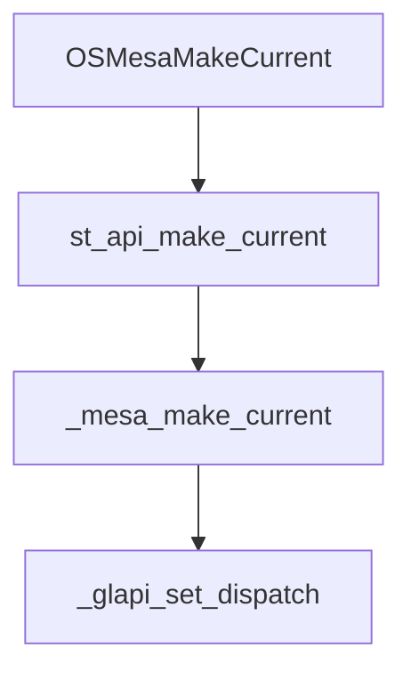

# Mesa3D

[官网](https://www.mesa3d.org)

[latest-docs](https://mesa-docs.readthedocs.io/en/latest)

[GL Dispatch 文档](https://docs.mesa3d.org/dispatch.html)

[源码目录结构](https://docs.mesa3d.org/sourcetree.html)

[DRI wiki](https://dri.freedesktop.org/wiki)

## 概念

### DRI

**Direct Rendering Infrastructure:** 是一种在 Linux 中用于实现硬件加速的图形渲染框架。**DRI 驱动程序** 是这个框架中的关键组件，用于管理和控制显卡硬件，以实现高效和高质量的图形渲染

#### DRI driver 的基本功能

* 用户空间程序可通过 DRI driver 直接访问显卡硬件(不需要内核空间), 提高性能
* 管理显卡上的帧缓冲区等内存
* 维护显卡的各种状态信息，如纹理、着色器、渲染目标等
* 同步多个应用程序或线程之间的操作, 避免数据竞争等并发问题

#### DRI driver 的常见类型

* Mesa: 支持多种显卡(Intel, AMD、NVIDIA, ...)
* 私有驱动: 一些硬件厂商（如NVIDIA）会提供 DRI driver，性能一般会更好

### GL Dispatch

[latest-docs](https://mesa-docs.readthedocs.io/en/latest/dispatch.html)

dispatch table(函数调度表 / 函数分发表)

* 每个 context 会绑定一个函数调度表，调用 GL function 时会根据当前 context 的该表查找函数然后调用
* 函数调度表本质是 **函数指针数组**，在不同入口函数(entry)中根据对应函数偏移量(offset)获取函数指针，强转为实际函数指针类型后调用函数

#### dispatch 数据结构

```c
// 不完整类型，只能使用指针，不能创建实例
struct _glapi_table;

struct gl_context {
    struct gl_dispatch Dispatch;        // 所有 GL 函数调度表
    struct _glapi_table *GLApi;         // 当前状态的函数调度表
};
```

#### dispatch 流程

```yml
_mesa_initialize_dispatch_tables:
    _mesa_alloc_dispatch_tables:
        - 初始化，只申请了内存，实际函数还没设置
        - 回调函数为默认的 generic_nop 或 glthread_nop
    _mesa_init_dispatch: 
        - 初始化 OutsideBeginEnd 调度表
        - 将 mesa 函数指针按指定 offset 插入到调度表中
_glapi_set_dispatch: 设置当前
获取 dispatch table:
    - 1. _glapi_get_dispatch
    - 2. _glapi_Dispatch
    - 3. _glapi_tls_Dispatch
static_cast: 强转为对应类型的函数指针然后调用函数
```

#### dispatch 示例

以 glBindBuffer 函数为例

```c
// 1. 定义实际回调函数
void _mesa_BindBuffer(GLuint target, GLuint buffer) {
    // ...
}

// 2. 注册回调函数并绑定到指定 offset
//    会生成 stub 函数连接外部调用和实际实现(_mesa_BindBuffer)
void _mesa_init_dispatch(struct gl_context *ctx) {
    // ...
    // 绑定当前位置为 mesa 中的函数指针
    // 当前位置即 offset，和后续通过 glBindArray 访问时内部获取该函数指针时使用的 offset 应一致
    SET_BindBuffer(table, _mesa_BindBuffer);
}

// 需要宏 MAPI_TMP_DEFINES，已经是过时的调用机制，这里只用作帮助理解
// 最新机制可能是通过 stub 函数调用
// 3. 定义 GL function 供用户访问
void glBindBuffer(GLenum target, GLuint buffer) {
    // 获取调度表
    const struct _glapi_table *_tbl = entry_current_get();
    // 定位回调函数
    mapi_func _func = ((const mapi_func *) _tbl)[461];
    // 调用函数，即调用 _mesa_BindBuffer
    ((void (GLAPIENTRY *)(GLenum target, GLuint buffer)) _func)(target, buffer);
}

// 4. 用户侧调用 GL function
glBindBuffer(GL_ARRAY_BUFFER, VBO);

// 5. 获取实际函数地址(是一个 stub 函数)
void (*glXGetProcAddressARB(const GLubyte *procName)) (void);

// 6. stub 函数会转到实际函数, 即 _mesa_BindBuffer, 具体细节还不清楚
```

#### mesa 中所有状态的函数调度表

```c
struct gl_dispatch {
    // For non-displaylist-saving, non-begin/end.
    struct _glapi_table *OutsideBeginEnd; 

    // between glBegin() and glEnd()
    struct _glapi_table *BeginEnd;

    // Same as BeginEnd except glVertex{Attrib} functions. 
    struct _glapi_table *HWSelectModeBeginEnd;

    // between glNewList() and glEndList()
    struct _glapi_table *Save;

    // when a graphics reset has happened
    struct _glapi_table *ContextLost;

   /**
    * The current dispatch table for non-displaylist-saving execution.
    * It can be equal to one of these:
    * - OutsideBeginEnd
    * - BeginEnd
    * - HWSelectModeBeginEnd
    */
   struct _glapi_table *Exec;

   /**
    * The current dispatch table overall. It can be equal to one of these:
    * - Exec
    * - Save
    * - ContextLost
    */
   struct _glapi_table *Current;
};
```

## 函数

### _mesa_error

打印 error 的函数

tips

* 打断点后传非法参数以查看函数调用堆栈

### OSMesaMakeCurrent

|function |desc
|- |-
|OSMesaMakeCurrent      |Bind an OSMesaContext to an image buffer
|st_api_make_current    |Bind the context to the calling thread with draw and read as drawables
|_mesa_make_current     |绑定 context 到 drawBuffer 和 readBuffer，并将其设置当前 context

在 _mesa_make_current 中会调用 **_glapi_set_dispatch** 设置函数调度表(dispatch table)

```c
/*
* \param newCtx  the new GL context. If NULL then there will be no current GL
 *                context.
 * \param drawBuffer  the drawing framebuffer
 * \param readBuffer  the reading framebuffer
 */
GLboolean
_mesa_make_current( struct gl_context *newCtx,
                    struct gl_framebuffer *drawBuffer,
                    struct gl_framebuffer *readBuffer );

```


