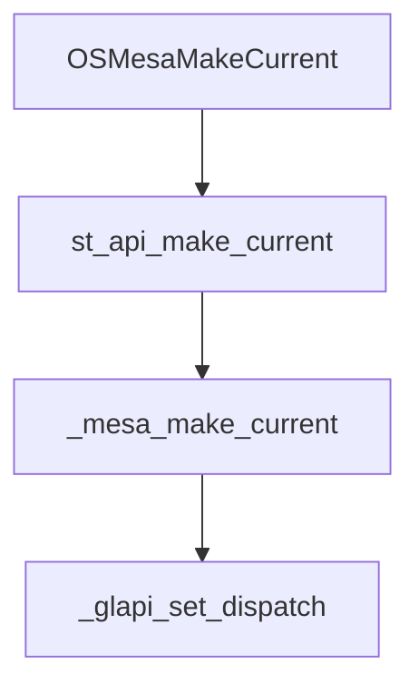

# Mesa3D

[官网](https://www.mesa3d.org)

[latest-docs](https://mesa-docs.readthedocs.io/en/latest)

[GL Dispatch 文档](https://docs.mesa3d.org/dispatch.html)

[源码目录结构](https://docs.mesa3d.org/sourcetree.html)

[DRI wiki](https://dri.freedesktop.org/wiki)

## 编译

[demo](https://archive.mesa3d.org/demos)

注意:

```txt
1.查看系统是否有 glvnd(pkg-config --modversion libglvnd)，如果有则不会编译出 libGL，使用 -Dglvnd=disabled 方式禁用
```

### 编译安装

[官网指南](https://docs.mesa3d.org/install.html)

[使用 meson 编译](https://docs.mesa3d.org/meson.html)

注意:

```txt
1. 优先使用系统提供的软件版本，没有符合要求的版本时再源码安装
2. 保证 LLVM 相关库版本一致
```

* 遇到缺少的环境时使用 apt 安装，如果没有就前加 lib 后加 -dev 试试
* 使用 apt search 查看哪些包包含所需组件
* 版本都太低就自己找源码编译

#### 安装系统库

```sh
# sudo apt install libglvnd-dev
sudo apt install -y libtizonia-dev
sudo apt install -y zstd
sudo apt install -y rust-1.80-all
sudo apt install -y libelf-dev
sudo apt install -y byacc
sudo apt install -y flex
sudo apt install -y bison
sudo apt install -y libwayland-dev
sudo apt install -y libwayland-egl1-mesa
sudo apt install -y libwayland-egl1-mesa
sudo apt install -y libwayland-dev
sudo apt install -y libwayland-egl-backend
sudo apt install -y libwayland-egl-backend-dev
sudo apt install -y libxcb-randr0-dev
sudo apt install -y libxext-dev
sudo apt install -y libxfixes-dev
sudo apt install -y libxcb-glx0-dev
sudo apt install -y libxcb-shm0-dev
sudo apt install -y libx11-xcb-dev
sudo apt install -y libxcb-dri2-0-dev
sudo apt install -y libxcb-dri3-dev
sudo apt install -y libxcb-present-dev
sudo apt install -y libxshmfence-dev
sudo apt install -y libxxf86vm-dev
sudo apt install -y libxrandr-dev
sudo apt install -y libclang-dev
sudo apt install -y cbindgen
sudo apt install -y glslang-tools
sudo apt install -y python3-pkgconfig
sudo apt install -y llvm-18-tools
sudo apt install -y libclc-18
sudo apt install -y libclc-18-dev
sudo apt install -y llvm-spirv-18
sudo apt install -y libllvmspirvlib-18-dev
sudo apt install -y python3-ply
sudo apt install -y bindgen
# pip install ply -i http://mirrors.aliyun.com/pypi/simple --trusted-host mirrors.aliyun.com
# 参考 rust#cargo 配置镜像源
cargo install --force cbindgen
# 如果报错使用了 unstable feature
rustup default nightly
sudo ln -s /usr/bin/llvm-config-18 /usr/bin/llvm-config
sudo ln -s /usr/bin/rustc-1.80 /usr/bin/rustc
```

#### DRM

[drm git仓库](git://anongit.freedesktop.org/mesa/drm)
[github镜像](https://github.com/Distrotech/libdrm)

Direct Rendering Manager，Linux内核中的一个子系统，用于提供对图形硬件的直接访问。

```sh
git clone git://anongit.freedesktop.org/mesa/drm
meson build
sudo ninja -C build install
```

#### 编译 LLVM

```sh
git clone https://github.com/llvm/llvm-project.git
# 根据需要使用 -D 设置选项
cmake -S llvm -B build -G "Unix Makefiles" -DLLVM_ENABLE_PROJECTS="clang;lld;libclc"
cd build
make -j8
```

#### 编译 llvm-spirv

```sh
git clone https://github.com/KhronosGroup/SPIRV-LLVM-Translator.git
mkdir build & cd build
cmake ..
make llvm-spirv
```

#### 编译 libclc

```sh
# 代码就是 llvm-project 代码
mkdir build-libclc & cd build-libclc
# llvm-spirv 使用使用的路径
cmake -S ../libclc -B . -G Ninja -DLLVM_CONFIG="$LLVM_CONFIG" -DLIBCLC_TARGETS_TO_BUILD="spirv-mesa3d-;spirv64-mesa3d-" -DCMAKE_BUILD_TYPE=Release -DCMAKE_INSTALL_PREFIX=/usr -DLLVM_SPIRV=/usr/bin/llvm-spirv
ninja -j8
ninja install
```

#### 编译 mesa

```sh
# prefix: 安装路径，如系统目录 /usr
# libdir: 一般 /usr/lib 或 /usr/lib64
# dri-drivers: 驱动路径，使用 find -type d -name dri 查找
# meson configure --prefix=/usr --libdir=xxx -D dri-drivers-path=xxx ..
mkdir -p build
# 使用 llvm 的选项要和编译时一致，如使用静态库，不使用 RTTI 等
meson setup build -Dprefix="/install/directory" -Dosmesa=true -Dshared-llvm=disabled -Dcpp_rtti=false --buildtype=debug
# meson setup .. -Ddefault_library=shared
# 使用指定版本的 llvm
# meson setup .. --native-file ../custom-llvm.ini
ninja -C build -j8       # meson compile -C .
sudo meson install

# 链接库(替代 libGL.so)
libGL.so(不使用 glvnd), libOSMesa.so
```

#### 使用 ACO

```sh
# gallium-drivers 只使用 radeonsi
meson setup build -Dprefix="/install/dir" --buildtype=debug -Damd-use-llvm=false -Dgallium-drivers=radeonsi
ninja -C build -j50
```

## 概念

### DRI

**Direct Rendering Infrastructure:** 是一种在 Linux 中用于实现硬件加速的图形渲染框架。**DRI 驱动程序** 是这个框架中的关键组件，用于管理和控制显卡硬件，以实现高效和高质量的图形渲染

#### DRI driver 的基本功能

* 用户空间程序可通过 DRI driver 直接访问显卡硬件(不需要内核空间), 提高性能
* 管理显卡上的帧缓冲区等内存
* 维护显卡的各种状态信息，如纹理、着色器、渲染目标等
* 同步多个应用程序或线程之间的操作, 避免数据竞争等并发问题

#### DRI driver 的常见类型

* Mesa: 支持多种显卡(Intel, AMD、NVIDIA, ...)
* 私有驱动: 一些硬件厂商（如NVIDIA）会提供 DRI driver，性能一般会更好

### GL Dispatch

[latest-docs](https://mesa-docs.readthedocs.io/en/latest/dispatch.html)

dispatch table(函数调度表 / 函数分发表)

* 每个 context 会绑定一个函数调度表，调用 GL function 时会根据当前 context 的该表查找函数然后调用
* 函数调度表本质是 **函数指针数组**，在不同入口函数(entry)中根据对应函数偏移量(offset)获取函数指针，强转为实际函数指针类型后调用函数

#### dispatch 数据结构

```c
// 不完整类型，只能使用指针，不能创建实例
struct _glapi_table;

struct gl_context {
    struct gl_dispatch Dispatch;        // 所有 GL 函数调度表
    struct _glapi_table *GLApi;         // 当前状态的函数调度表
};
```

#### dispatch 流程

```yml
_mesa_initialize_dispatch_tables:
    _mesa_alloc_dispatch_tables:
        - 初始化，只申请了内存，实际函数还没设置
        - 回调函数为默认的 generic_nop 或 glthread_nop
    _mesa_init_dispatch: 
        - 初始化 OutsideBeginEnd 调度表
        - 将 mesa 函数指针按指定 offset 插入到调度表中
_glapi_set_dispatch: 设置当前
获取 dispatch table:
    - 1. _glapi_get_dispatch
    - 2. _glapi_Dispatch
    - 3. _glapi_tls_Dispatch
static_cast: 强转为对应类型的函数指针然后调用函数
```

#### dispatch 示例

以 glBindBuffer 函数为例

```c
// 1. 定义实际回调函数
void _mesa_BindBuffer(GLuint target, GLuint buffer) {
    // ...
}

// 2. 注册回调函数并绑定到指定 offset
//    会生成 stub 函数连接外部调用和实际实现(_mesa_BindBuffer)
void _mesa_init_dispatch(struct gl_context *ctx) {
    // ...
    // 绑定当前位置为 mesa 中的函数指针
    // 当前位置即 offset，和后续通过 glBindArray 访问时内部获取该函数指针时使用的 offset 应一致
    SET_BindBuffer(table, _mesa_BindBuffer);
}

// 需要宏 MAPI_TMP_DEFINES，已经是过时的调用机制，这里只用作帮助理解
// 最新机制可能是通过 stub 函数调用
// 3. 定义 GL function 供用户访问
void glBindBuffer(GLenum target, GLuint buffer) {
    // 获取调度表
    const struct _glapi_table *_tbl = entry_current_get();
    // 定位回调函数
    mapi_func _func = ((const mapi_func *) _tbl)[461];
    // 调用函数，即调用 _mesa_BindBuffer
    ((void (GLAPIENTRY *)(GLenum target, GLuint buffer)) _func)(target, buffer);
}

// 4. 用户侧调用 GL function
glBindBuffer(GL_ARRAY_BUFFER, VBO);

// 5. 获取实际函数地址(是一个 stub 函数)
void (*glXGetProcAddressARB(const GLubyte *procName)) (void);

// 6. stub 函数会转到实际函数, 即 _mesa_BindBuffer, 具体细节还不清楚
```

#### mesa 中所有状态的函数调度表

```c
struct gl_dispatch {
    // For non-displaylist-saving, non-begin/end.
    struct _glapi_table *OutsideBeginEnd; 

    // between glBegin() and glEnd()
    struct _glapi_table *BeginEnd;

    // Same as BeginEnd except glVertex{Attrib} functions. 
    struct _glapi_table *HWSelectModeBeginEnd;

    // between glNewList() and glEndList()
    struct _glapi_table *Save;

    // when a graphics reset has happened
    struct _glapi_table *ContextLost;

   /**
    * The current dispatch table for non-displaylist-saving execution.
    * It can be equal to one of these:
    * - OutsideBeginEnd
    * - BeginEnd
    * - HWSelectModeBeginEnd
    */
   struct _glapi_table *Exec;

   /**
    * The current dispatch table overall. It can be equal to one of these:
    * - Exec
    * - Save
    * - ContextLost
    */
   struct _glapi_table *Current;
};
```

## 函数

### _mesa_error

打印 error 的函数

tips

* 打断点后传非法参数以查看函数调用堆栈

### OSMesaMakeCurrent

|function |desc
|- |-
|OSMesaMakeCurrent      |Bind an OSMesaContext to an image buffer
|st_api_make_current    |Bind the context to the calling thread with draw and read as drawables
|_mesa_make_current     |绑定 context 到 drawBuffer 和 readBuffer，并将其设置当前 context

在 _mesa_make_current 中会调用 **_glapi_set_dispatch** 设置函数调度表(dispatch table)

```c
/*
* \param newCtx  the new GL context. If NULL then there will be no current GL
 *                context.
 * \param drawBuffer  the drawing framebuffer
 * \param readBuffer  the reading framebuffer
 */
GLboolean
_mesa_make_current( struct gl_context *newCtx,
                    struct gl_framebuffer *drawBuffer,
                    struct gl_framebuffer *readBuffer );

```



### _mesa_CompileShader

GLSL code -> frontend IR

```c
// shaderObj: 由 glCreateShader 生成的对象编号
void _mesa_CompileShader(GLuint shaderObj);
```

调用堆栈

```txt
glCompileShader             ->
_mesa_CompileShader         ->
_mesa_compile_shader        ->
_mesa_glsl_compile_shader
```

编译结果保存在 GLSL shader object(frontend IR) 中，对象类型为 **gl_shader**
gl_shader 对象由 **_mesa_lookup_shader_err** 函数生成

### _mesa_lookup_shader_err

生成 gl_shader 对象，该对象在 glCreateShader 时已经创建，保存在一个 **哈希表** 中(_mesa_HashTable)

```c
// ctx   : context
// name  : 由 glCreateShader 生成的对象编号
// caller: 主调函数名称
struct gl_shader * _mesa_lookup_shader_err(struct gl_context *ctx, GLuint name, const char *caller);
```
