# OpenGL

[官网](https://www.opengl.org)

[API](https://www.khronos.org/opengl/wiki/Category:Core_API_Reference)

[LLVM官网](https://releases.llvm.org)

[glfw官网](https://www.glfw.org)

[glew官网](https://glew.sourceforge.net/index.html)

[Specifications](https://registry.khronos.org/OpenGL/index_gl.php#apispecs)

[Windows OpenGL Learn](https://learn.microsoft.com/zh-cn/windows/win32/opengl/opengl)

[learnopengl](https://learnopengl.com)

[learnopengl-CN](https://learnopengl-cn.readthedocs.io/zh/latest)

[Vulkan Tutorial](https://vulkan-tutorial.com)

[OpenCL Guide](https://github.com/KhronosGroup/OpenCL-Guide)

* OpenGL 只是规范(Specification)，并不提供具体实现(Source Code)
* [Mesa3D](https://www.mesa3d.org) 是一个开源的实现版本, 显卡驱动也是实现
* 显卡供应商如 Nvidia 会提供 SDK 及 demo

## 缩写/中英文对照

### 缩写

|Abbr |Full
|- |-
|OpenGL |Open Graphics Library
|GLUT   |OpenGL Utility Toolkit
|GLw    |OpenGL Widget Library
|GLEW   |OpenGL Extension Wrangler Library
|GLFW   |OpenGL Framework Window
|GLSL   |OpenGL Shading Language
|NDC    |Normalized Device Coordinates
|VBO    |Vertex Buffer Objects
|VAO    |Vertex Array Object
|IBO    |Index Buffer Object
|EBO    |Element Buffer Object
|Texel  |Texture Pixel
|SOIL   |Simple OpenGL Image Library
|GLM    |OpenGL Mathematics
|FOV    |Field of View

### 中英文对照

|EN |CN
|- |-
|Immediate mode             |立即渲染模式(固定渲染管线)
|Core-profile               |核心模式
|State Machine              |状态机
|State-changing Function    |状态设置函数
|State-using Function       |状态应用函数
|Primitive Type             |基元类型: GL 定义的基础类型如 GLfloat
|Viewport                   |视口
|Graphics Pipeline          |图形渲染管线

#### 着色器

|EN |CN
|- |-
|Shader                     |着色器: 执行渲染工作的程序
|OpenGL Shading Language    |OpenGL 着色器语言
|Vertex Shader              |顶点着色器: 在 **GPU** 显存上存储顶点数据
|Shape(Primitive) Assembly  |形状(图元)装配
|Geometry Shader            |几何着色器
|Rasterization              |光栅化
|Rasterizer                 |光栅器
|Fragment Shader            |片段着色器: 计算像素点最终颜色等
|Tests And Blending         |测试与混合: 检查片段深度和透明度等
|Primitive                  |图元: GL 定义的形状类型如 GL_POINTS
|Fragment                   |片段: 一个片段是OpenGL渲染一个像素所需的所有数据
|Blend                      |混合
|Stencil                    |(深度)模板
|NDC                        |标准化设备坐标: x,y,z 有效范围都是 (-1,1)，范围外会被裁剪掉，对应 glViewport 设置的视口范围
|Screen-space Coordinates   |屏幕空间坐标
|Viewport Transform         |视口变换
|VBO                        |顶点缓冲对象: 将内存数据缓冲后传递到显存中并维护
|VAO                        |[顶点数组对象](#vao)
|EBO/IBO                    |索引缓冲对象: 专门缓冲索引
|Indexed Drawing            |索引绘制: 根据索引获取顶点数据进行绘制
|Wireframe Mode             |线框模式

#### 纹理

|EN |CN
|- |-
|Texture                    |纹理
|Texture Map                |纹理映射
|Texture Pixel              |纹理像素
|Texture Filtering          |纹理过滤
|Texture Unit               |纹理单元
|Fragment Interpolation     |片段插值
|Sampling                   |采样
|Sampler                    |采样器
|Wrapping                   |环绕方式
|Resolution                 |分辨率
|Nearest Neighbor Filtering |临近过滤，GL_NEAREST
|Linear Filtering           |线性过滤，GL_LINEAR
|Magnify/Minify             |放大/缩小
|Mipmap                     |多级渐远纹理

#### Transform

|EN |CN
|- |-
|Position Vector                |位置向量(有 Direction 和 Magnitude)
|Scalar                         |标量
|Component-wise                 |(向量)分量
|Pythagoras Theorem             |毕达哥拉斯定理(勾股定理)
|Unit Vector                    |单位向量: 长度为 1 的向量
|Orthogonal                     |(向量)正交: 两个向量夹角为直角
|Vector Negation                |向量取反
|Vector-vector Multiplication   |向量乘法
|Vector dot product             |向量点乘
|Vector cross product           |向量叉乘
|Matrix                         |矩阵
|Matrix Element                 |矩阵元素
|Identity Matrix                |单位矩阵: 对角线元素为 1，其他为 0
|Transposed Matrix              |转置矩阵: 交换矩阵行列
|Inverse Matrix                 |逆矩阵: AB = BA = I 则 AB 互为逆矩阵
|Scaling Factor                 |缩放因子
|Uniform Scale                  |均匀缩放: 所有维度缩放因子一样
|Column-Major Ordering          |(矩阵)列主序: 先索引列后索引行
|Non-uniform Scale              |不均匀缩放: 缩放因子在不同维度不一样
|Translation                    |位移
|Homogeneous Coordinates        |齐次坐标: xyzw 向量中的 w 分量
|Direction Vector               |方向向量: 齐次坐标为 0，无法位移
|Rotation Axis                  |旋转轴
|Quaternion                     |四元数
|Euler Angle                    |欧拉角
|Pitch                          |(欧拉角)俯仰角: 绕 x 轴
|Yaw                            |(欧拉角)偏航角: 绕 y 轴
|Roll                           |(欧拉角)滚转角: 绕 z 轴
|Normal Matrix                  |正规矩阵: transpose(inverse(Matrix))

#### 坐标系统

|EN |CN
|- |-
|Coordinate System              |坐标系统
|Local/Object Space             |局部空间
|World Space                    |世界空间
|View/Camera/Eye Space          |观察空间
|Clip Space                     |裁剪空间
|Screen Space                   |屏幕空间
|Model Matrix                   |模型矩阵: 将局部坐标转换到世界坐标
|View Matrix                    |观察矩阵: 将世界坐标转换到观察坐标
|Projection Matrix              |投影矩阵: 将观察坐标转换到裁剪坐标
|Viewport Transform             |视口变换
|Coordinate Set                 |坐标集
|Clipping Volume                |裁剪体积
|Viewing Box                    |观察区域
|Frustum                        |平截头体: 由投影矩阵创建的观察区域
|Perspective Division           |透视划分: 将4维裁剪空间坐标转换为3维标准化设备坐标
|Orthographic Projection        |正交投影
|Perspective Projection         |透视投影
|FOV                            |[(竖直方向)视野](./GLM.md#投影矩阵)
|Right-handed System            |右手系，OpenGL 是右手坐标系
|Z-buffer/Depth Buffer          |Z/深度 缓冲区: 存储深度信息
|Depth Testing                  |深度测试

#### 摄像机

|EN |CN
|- |-
|Direction Vector               |方向向量，注意该向量是指向自身的
|Right Vector                   |右向量: 摄像机空间的 x 轴的正方向
|Up Vector                      |上向量: 摄像机空间的 y 轴正方向
|Gram-Schmidt                   |葛兰-施密特正交

#### 光照

|EN |CN
|- |-
|Lighting                       |光照
|Cast the light                 |投射光
|Phong Lighting Model           |冯氏光照模型
|Ambient Lighting               |(冯氏)环境光
|Diffuse Lighting               |(冯式)漫反射
|Specular Lighting              |(冯氏)镜面反射
|Specular Intensity             |镜面强度: 物体进行镜面反射能力
|Reflect                        |(光)反射
|Global Illumination            |全局照明
|Normal Vector                  |法向量: 垂直于顶点表面的向量
|Shininess                      |发光值: 越大反射光的能力越强，散射越少，高光点越小
|Gouraud                        |在顶点着色器中实现冯氏光照
|Material                       |材质
|Scatter                        |散射
|Highlight                      |高光点
|Lighting Maps                  |光照贴图
|Diffuse Texture                |漫反射贴图: 通过纹理表示物体的 diffuse 颜色
|Specular Texture               |镜面贴图: 通过纹理表示物体的 specular 颜色
|Emission Map                   |放射光贴图
|Emission Value                 |发光值
|Light Caster                   |投光物: 光源
|Directional Light              |定向光: 光源无限远，即平行光
|Point Light                    |点光
|Spotlight                      |聚光
|Attenuation                    |(光线)衰减

## 系统自带 OpenGL 库及查看版本

* Windows: opengl32.lib 或 opengl32.dll
* Linux: libGL.so
* 自定义: Mesa

```c
// OpenGL 版本号
glGetIntegerv(GL_MAJOR_VERSION, *);
glGetIntegerv(GL_MINOR_VERSION, *);
glGetString(GL_VERSION);                    // OpenGL 版本号
glGetString(GL_VENDOR);                     // 实现当前版本的厂商
glGetString(GL_RENDERER);                   // 渲染器(GPU)名称
glGetString(GL_SHADING_LANGUAGE_VERSION​);   // 支持的 GLSL 版本
```

## 概念

### Graphics Pipeline

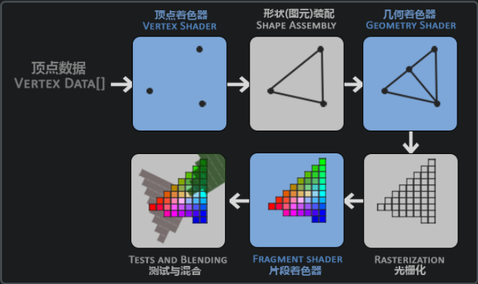

### EGL/GLES

GLES (OpenGL for Embedded Systems) 是一种为嵌入式系统设计的图形API。它是OpenGL的一个子集，比桌面版的OpenGL精简，去掉了许多复杂的功能，旨在提供一个更轻量级的图形API，适合性能和资源有限的设备。

EGL (Embedded-System Graphics Library) 是一个中间层接口，主要用于在OpenGL ES（GLES）和本地窗口系统（如X Window系统或Android的Surface）之间提供连接。它负责创建和管理OpenGL ES上下文，处理图形缓冲区的分配以及交换缓冲区等操作。

### GLFW

[download](https://www.glfw.org/download.html)

GLFW 是一个跨平台的库，用于创建窗口和处理输入事件，如键盘、鼠标和游戏手柄。它提供了一系列函数，用于设置窗口的属性、处理窗口的消息循环以及处理各种输入设备的事件。GLFW 的目标是为 OpenGL 程序提供一个轻量级、高效和跨平台的窗口和输入接口。

### GLEW

[download](https://glew.sourceforge.net/index.html)

GLEW 是一个用于 OpenGL 扩展的库，它可以帮助开发者高效地检测和加载 OpenGL 扩展。GLEW 提供了一个简单的接口来检测当前系统上支持的 OpenGL 版本以及可用的扩展，并且能够自动加载所需的函数指针。

### State Machine AND Context

OpenGL自身是一个巨大的状态机：一系列变量描述 OpenGL 此刻应当如何运行。OpenGL的状态通常被称为OpenGL上下文(Context)。我们通常使用如下途径去更改OpenGL状态：设置选项(enable)，操作缓冲(buffer)。最后，我们使用当前OpenGL上下文来渲染。

* 可以将 context 看作是驱动用来保存 GL 程序状态信息的大结构体
* context 是所有 GL 函数的隐式参数
* context 包含许多资源，如 driver resources in RAM, texture IDs assigned, VBO IDs assigned, enabled states 等
* 使用 GL function 前必须创建 GL context 并设置为当前 context(可以从窗口创建?)
* 每个线程都有自身的 context，一个 context 不能同时被多个线程设置为当前

### 双缓冲(Double Buffer)

应用程序使用单缓冲绘图时可能会存在图像闪烁的问题。 这是因为生成的图像不是一下子被绘制出来的，而是按照从左到右，由上而下逐像素地绘制而成的。最终图像不是在瞬间显示给用户，而是通过一步一步生成的，这会导致渲染的结果很不真实。为了规避这些问题，我们应用双缓冲渲染窗口应用程序。前缓冲保存着最终输出的图像，它会在屏幕上显示；而所有的的渲染指令都会在后缓冲上绘制。当所有的渲染指令执行完毕后，我们交换(Swap)前缓冲和后缓冲，这样图像就立即呈显出来，之前提到的不真实感就消除了。

### depth / 深度值

通常可以理解为 z 坐标，它代表一个像素在空间中和你的距离，如果离你远就可能被别的像素遮挡，你就看不到它了，它会被丢弃，以节省资源。

### Shader Program(着色器)

[GLSL](./GLSL.md)

着色器程序(Shader Program)是运行在 GPU 上的小程序。

着色器程序对象(Shader Program Object)是多个着色器合并之后并最终链接完成的版本。如果要使用编译好的着色器必须把它们链接为一个着色器程序对象，然后在渲染对象的时候激活这个着色器程序。已激活着色器程序的着色器将在我们发送渲染调用的时候被使用。

当链接着色器至一个程序的时候，它会把每个着色器的输出链接到下个着色器的输入。当输出和输入不匹配的时候，会得到一个连接错误。

### VAO

一个顶点数组对象会储存以下这些内容：

* **glEnableVertexAttribArray** 和 **glDisableVertexAttribArray** 的调用
* 通过 **glVertexAttribPointer** 设置的顶点属性配置
* 通过 **glVertexAttribPointer** 调用进行的顶点缓冲对象与顶点属性链接
* 绑定的 EBO 对象(EBO 对象在 VAO 解绑前不能解绑)

```cpp
GLuint VAO;
glGenVertexArrays(1, &VAO);
// ..:: 初始化代码 :: ..
// 1. 绑定顶点数组对象
glBindVertexArray(VAO);
    // 2. 把我们的顶点数组复制到一个顶点缓冲中，供OpenGL使用
    glBindBuffer(GL_ARRAY_BUFFER, VBO);
    glBufferData(GL_ARRAY_BUFFER, sizeof(vertices), vertices, GL_STATIC_DRAW);
    // 3. 复制我们的索引数组到一个索引缓冲中，供OpenGL使用
    glBindBuffer(GL_ELEMENT_ARRAY_BUFFER, EBO);
    glBufferData(GL_ELEMENT_ARRAY_BUFFER, sizeof(indices), indices, GL_STATIC_DRAW);
    // 3. 设定顶点属性指针
    glVertexAttribPointer(0, 3, GL_FLOAT, GL_FALSE, 3 * sizeof(GLfloat), (GLvoid*)0);
    glEnableVertexAttribArray(0);
// 4. 解绑VAO（不是EBO！）
glBindVertexArray(0);

// ..:: 绘制代码（游戏循环中） :: ..

glUseProgram(shaderProgram);
glBindVertexArray(VAO);
glDrawElements(GL_TRIANGLES, 6, GL_UNSIGNED_INT, 0)
glBindVertexArray(0);
```

### Texture

纹理是一个2D图片（甚至也有1D和3D的纹理）。除了图像以外，纹理也可以被用来储存大量的数据，这些数据可以发送到着色器上。

#### 纹理环绕方式

纹理坐标的范围通常是从(0, 0)到(1, 1)，超出部分根据以下方式处理

|环绕方式(Wrapping) |desc
|- |-
|GL_REPEAT          |重复纹理图像(默认行为)
|GL_MIRRORED_REPEAT |和GL_REPEAT一样，但每次重复图片是镜像放置的
|GL_CLAMP_TO_EDGE   |超出的部分会重复纹理坐标的边缘，产生一种边缘被拉伸的效果
|GL_CLAMP_TO_BORDER |超出的坐标为用户指定的边缘颜色

[代码应用位置](#soil)

```c
// 纹理坐标轴为 str, 等价于 xyz
// 设置 Wrapping
glTexParameteri(GL_TEXTURE_2D, GL_TEXTURE_WRAP_S, GL_MIRRORED_REPEAT);
glTexParameteri(GL_TEXTURE_2D, GL_TEXTURE_WRAP_T, GL_MIRRORED_REPEAT);
float borderColor[] = { 1.0f, 1.0f, 0.0f, 1.0f };
glTexParameterfv(GL_TEXTURE_2D, GL_TEXTURE_BORDER_COLOR, borderColor);
```

#### 纹理过滤

```yml
GL_NEAREST: 选择中心点最接近纹理坐标的那个像素(默认方式)
GL_LINEAR : 基于纹理坐标附近的纹理像素，计算出一个插值
```

```c
// 指定放大/缩小时纹理过滤方式
glTexParameteri(GL_TEXTURE_2D, GL_TEXTURE_MIN_FILTER, GL_NEAREST);
glTexParameteri(GL_TEXTURE_2D, GL_TEXTURE_MAG_FILTER, GL_LINEAR);
```

#### 多级渐远纹理(Mipmap)

简单来说就是一系列的纹理图像，后一个纹理图像尺寸是前一个的二分之一，OpenGL 会根据观察者距离使用不同的纹理。可以使用 **glGenerateMipmaps** 自动生成 Mipmap。

Mipmap 机制仅适用于纹理被缩小的情况。纹理放大就是上面的纹理过滤方式。

Mipmap 切换过滤方式

|过滤方式 |desc
|- |-
|GL_NEAREST_MIPMAP_NEAREST  |使用最临近 mipmap, 临近过滤
|GL_LINEAR_MIPMAP_NEAREST   |使用最临近 mipmap, 线性插值
|GL_NEAREST_MIPMAP_LINEAR   |使用相邻 mipmap 线性插值, 临近过滤
|GL_LINEAR_MIPMAP_LINEAR    |使用相邻 mipmap 线性插值, 线性插值

```c
// 设置缩小图像为 mipmap 方式
glTexParameteri(GL_TEXTURE_2D, GL_TEXTURE_MIN_FILTER, GL_LINEAR_MIPMAP_LINEAR);
// 设置放大图像过滤方式
glTexParameteri(GL_TEXTURE_2D, GL_TEXTURE_MAG_FILTER, GL_LINEAR);
```

#### 加载与创建纹理

##### SOIL

[SOIL](https://github.com/SpartanJ/SOIL2)

使用 SOIL 加载的图片是上下颠倒的，因为 OpenGL 的 y 轴坐标原点在图片 **底部**，但是图片本身的 y 轴坐标原点通常在 **顶部**。SOIL 并没有在加载时重置 y 原点。

```c
GLuint gen_texture(const char *img_path) {
    GLuint texture;
    glGenTextures(1, &texture);
    glBindTexture(GL_TEXTURE_2D, texture);
    // 设置环绕方式
    glTexParameteri(GL_TEXTURE_2D, GL_TEXTURE_WRAP_S, GL_MIRRORED_REPEAT);
    glTexParameteri(GL_TEXTURE_2D, GL_TEXTURE_WRAP_T, GL_MIRRORED_REPEAT);
    int width, height;
    // 加载图片资源
    unsigned char *img = SOIL_load_image(img_path, &width, &height, 0, SOIL_LOAD_RGB);
    glTexImage2D(GL_TEXTURE_2D, 0, GL_RGB, width, height, 0, GL_RGB, GL_UNSIGNED_BYTE, img);
    // 创建 mipmap
    glGenerateMipmap(GL_TEXTURE_2D);
    SOIL_free_image_data(img);
    glBindTexture(GL_TEXTURE_2D, 0);
    return texture;
}
```

##### 使用多个纹理单元

```c
// 有 0 ~ 15 共 16 个纹理单元可以使用
glActiveTexture(GL_TEXTURE0);           // 先激活指定纹理单元
glBindTexture(GL_TEXTURE_2D, texture);  // 再绑定
// 将 GLSL 中声明的 sampler2D 变量关联到 0 号纹理单元
glUniform1i(glGetUniformLocation(shader_program, "GLSL_texture_name", 0));
```

### Transformations(变换)

#### 向量

既有方向 (**Direction**) 又有大小 (**Magnitude**)

一个有三个维度 (**Dimension**) 的向量:

$$
\vec{v} = \begin{pmatrix}
x \\
y \\
z
\end{pmatrix}
$$

**标量运算(+-*/):** $ \begin{pmatrix} x \\ y \\ z \end{pmatrix} + a = \begin{pmatrix} x + a \\ y + a \\ z + a \end{pmatrix} $

**取反:** $ -\begin{pmatrix} x \\ y \\ z \end{pmatrix} = \begin{pmatrix} -x \\ -y \\ -z \end{pmatrix} $

**向量加法:** $
\begin{pmatrix} x \\ y \\ z \end{pmatrix} +
\begin{pmatrix} a \\ b \\ c \end{pmatrix} =
\begin{pmatrix} x + a \\ y + b \\ z + c \end{pmatrix} $

**向量减法:** $
\begin{pmatrix} x \\ y \\ z \end{pmatrix} -
\begin{pmatrix} a \\ b \\ c \end{pmatrix} =
\begin{pmatrix} x - a \\ y - b \\ z - c \end{pmatrix} $

**长度:** 使用勾股定理计算，表示为 **$ ||\vec{v}|| $**

**分量乘法(Component-wise Multiplication):** $
\begin{pmatrix} x \\ y \\ z \end{pmatrix} ·
\begin{pmatrix} a \\ b \\ c \end{pmatrix} =
\begin{pmatrix} x * a \\ y * b \\ z * c \end{pmatrix}$

**向量点乘定义:** $ \vec{v} · \vec{k} = ||\vec{v}|| * ||\vec{k}|| * cos(θ) $ ，其中 **$θ$** 为两个向量间夹角
**向量点乘:** $
\begin{pmatrix} x \\ y \\ z \end{pmatrix} ·
\begin{pmatrix} a \\ b \\ c \end{pmatrix} =
x * a + y * b + z * c $

**向量叉乘定义:** 两个不平行向量叉乘后生成一个正交于这两个向量的第三个向量，其长度为 $||\vec{v1}|| * ||\vec{v2}|| * sin(θ)$。
**向量叉乘:** 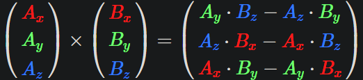

#### 矩阵

二维矩阵索引先索引行再索引列

**加标量:** 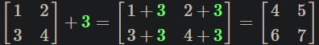

**矩阵相加:** 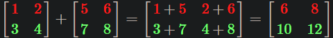

**乘标量:** 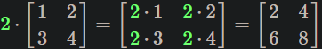

**矩阵乘法规则:**

* 要求: 前一个矩阵的**列数**要和后一个矩阵的**行数**一致
* 矩阵相乘的结果也是一个矩阵，行数为前一个矩阵行数，列数为后一个矩阵列数
* 结果矩阵元素计算方式: 前一个矩阵的**行**(中每一个元素) 分别乘以**相同索引**的 后一个矩阵的**列**(中每一个元素)，作为结果矩阵中该 **行列** 位置的元素，如 M1 第 a 行乘以 M2 第 b 列作为 M3 第 a 行 b 列元素
* 矩阵乘法不满足交换律

**矩阵相乘:** 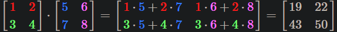

**矩阵乘向量:** 把向量作为 1 列的矩阵相乘

#### 缩放 / 位移 / 旋转矩阵

缩放矩阵: 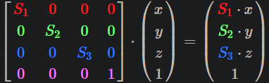

位移矩阵: 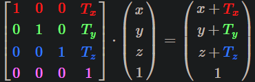

沿 x 轴旋转: 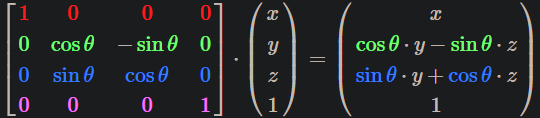
沿 y 轴旋转: 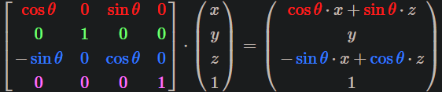
沿 z 轴旋转: 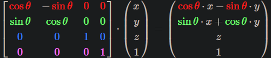

#### 组合矩阵

对目标进行操作顺序应该是: **缩放 -> 旋转 -> 位移**，否则容易相互干扰
创建矩阵时顺序则 **相反**，位移矩阵需要在最前面

$$ \vec{Final} = \vec{Translate} · \vec{Rotate} · \vec{Scale} $$

后方矩阵操作(Scale)不会影响前方矩阵操作(Translate)

#### GLM

[GLM](./GLM.md)

### Coordinate System(坐标系统)

右手坐标系示意图: X(大拇指)，Y(食指)，Z(中指)

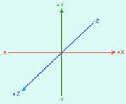

```yml
Local Coordinate    : 相对于局部原点的坐标
Global Coordinate   : 相对于世界原点
View Coordinate     : 相对于摄像机(Camera)或观察者
Clip Coordinate     : 处理 (-1, 1) 范围并判断哪些顶点会出现在屏幕上
Screen Coordinate   : 视口变换
```

#### 坐标变换

$$
\vec{Vclip} = M_{projection} · M_{view} · M_{model} · \vec{Vlocal}
$$

从创建物体到最终显示到屏幕上:

注意: **View Matrix** 最终是应用到 **场景** 上的而不是摄像机上

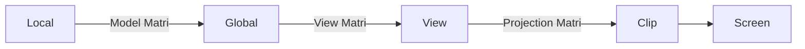

#### Clip Coordinate

正交投影: 定义一个立方体，只有立方体内的物体会被保留，然后将三个维度的坐标映射到 **[-1, 1]**
透视投影: 修改了每个顶点坐标的 **w** 值，**越远** w **越大**，每个顶点坐标的分量都会除以它的 **w** 分量

#### 视口变换

将 [-1, 1] 范围内的坐标准换到有 glViewport 定义的坐标范围内, 即 Clip Space -> Screen Space。之后坐标会经光栅器片段化。

#### Z/深度 缓冲区

深度信息存储在每个片段里面(作为片段的 **z** 值)当片段像输出颜色时，OpenGL会将它的 **深度值** 和 **z** 缓冲进行 **比较**, 如果当前的片段在其它片段之后, 它将会被丢弃，否则覆盖之前的片段。这个过程称为深度测试(Depth Testing), 是由OpenGL自动完成的。

```c
glEnable(GL_DEPTH_TEST);        // 开启深度测试
glDisable(GL_DEPTH_TEST);       // 关闭深度测试

// 清空颜色缓冲和深度缓冲
glClear(GL_COLOR_BUFFER_BIT | GL_DEPTH_BUFFER_BIT);
```

### Camera(摄像机)

OpenGL本身 **没有** 摄像机的概念，但我们可以通过把场景中的所有物体往相反方向移动的方式来模拟出摄像机，这样感觉就像我们在移动，而不是场景在移动。

我们需要一个摄像机在世界空间中的 **位置**、**观察的方向**、一个**指向它的右测的向量**以及一个**指向它上方的向量**。实际上创建了一个三个单位轴相互垂直的、以摄像机的位置为原点的坐标系。

#### Delta Time

上一帧到当前帧时间间隔，所有单位速度都应该乘以该时间间隔再应用，表示物体在当前帧的移动距离，以保证在不同帧率下实际运动速度是一致的

#### Look At

[lookAt](./GLM.md#lookat)

#### 视角移动(Euler Angle)

[右手坐标系示意图](#coordinate-system坐标系统)

对于单位向量 uv (假设 -Z 为正前方，+X 为右向量方向，+Y 为上向量方向)

```yml
pitch: 俯仰角，即 uv 在 YZ 平面上与 -Z 夹角
yaw  : 偏航角，即 uv 在 XZ 平面上与 -Z 夹角
```

uv 在 xyz 方向上的分量为:

$x = -1 * cos(pitch) * sin(yaw)$
$y = -1 * sin(pitch)$
$z = -1 * cos(pitch) * cost(yaw)$

### Lighting(光照)

在 OpenGL 中创建一个光源时都会指定一个颜色，光源颜色与物体颜色相乘就是这个物体反射该光源的颜色

$\vec{C}_{final} = \vec{C}_{light} · \vec{C}_{object}$

#### Phong Lighting Model

冯氏光照模型

* 环境光照(Ambient Lighting): 始终给物体一些颜色，并不是完全黑暗
* 漫反射光照(Diffuse Lighting): 模拟光源对物体不同方向的影响，面相光源一侧更亮
* 镜面光照(Specular Lighting): 模拟有光泽物体上的亮点，相比于物体本身颜色更倾向于光的颜色

##### Ambient

用光的颜色乘以一个数值很小的常量环境因子(如 0.1)，再乘以物体颜色即可简单模拟

$\vec{C}_{light} · {Factor} · \vec{C}_{object}$

##### Diffuse

光线与物体法线夹角 (θ) 越小，对物体颜色的影响越小，影响因子为 **$cos(θ)$**

着色器数据传递:

* 所有光照的计算需要在片段着色器里进行，需要把法向量由顶点着色器传递到片段着色器
* 在顶点着色器中使用模型矩阵将顶点坐标转换为世界坐标，传递给片段着色器: $\vec{P}_{current} = vec3(M_{model} * vec4(\vec{P}_{object}, 1.f))$
* 在片段着色器中计算漫反射颜色，需要多相关向量进行标准化 **(normalize)**

##### Specular

光线经物体反射后方向与视线(反射点指向观察点)夹角越小，对物体颜色影响越大

* 将摄像机位置视作观察点坐标，从反射点指向观察点的向量即为观察向量
* 反射光强度受物体发光值影响

### Material(材质)

物体材质

* 定义物体材质需要修改不同光照属性比例
* 设置 uniform 时需要分别设置结构体中每个属性
* 物体材质(Material) 与 光属性(Light) 共同决定最终颜色

```c
#version 330 core
struct Material {
    vec3 ambient;
    vec3 diffuse;
    vec3 specular;
    float shininess;
};
uniform Material material;
```

```c
// 单独设置结构体属性
glUniform3f(glGetUniformLocation(program, "material.ambient"), x, y, z);
```

光属性

```c
#version 330 core
struct Light {
    vec3 ambient;       // light_color * ambient_strength
    vec3 diffuse;       // light_color
    vec3 specular;      // light_color
    vec3 position;      // 光源位置
};
uniform Light light;
```

最终效果

```c
// 环境光
vec3 ambient_color = light.ambient * material.ambient;

// 漫反射光
vec3 light_dir = normalize(light.position - cur_pos);
vec3 normal = normalize(Normal);
float diff_strength = max(dot(normal, light_dir), 0.f);
vec3 diffuse_color = light.diffuse * material.diffuse * diff_strength;

// 镜面高光
vec3 view_dir = normalize(view_pos - cur_pos);
vec3 reflect_dir = reflect(-light_dir, Normal);
float specular_strength = pow(max(dot(view_dir, reflect_dir), 0.f), material.shininess);
vec3 specular_color = light.specular * material.specular * specular_strength;

vec3 final_color = ambient_color + diffuse_color + specular_color;
color = vec4(final_color, 1.f);
```

### Lighting Texture(光照贴图)

* 镜面贴图中白色的点镜面反射强，黑色的点镜面反射弱
* RGB 直接加在像素点颜色上可以模拟发光效果

```c
struct Material {
    // 省略 ambient，因为其值在大多数情况下和 diffuse 一样
    sampler2D diffuse;      // 使用贴图表示 diffuse
    sampler2D specular;     // 使用贴图表示 specular
    float shininess;
};
...
in vec2 TexCoords;
```

### Light Casters

* Directional Light: 光源无限远的平行光，方向一般定义为从光源发出
* Point Light: 向所有方向发光，随距离增加变暗
* Spotlight: 只朝某个方向照射的点光源

点光源衰减公式([$K_c,K_l,K_q$取值参考](https://learnopengl-cn.readthedocs.io/zh/latest/02%20Lighting/05%20Light%20casters)):

$$F_{att} = \frac{1.0}{K_c + K_l * d + K_q * d^2}$$

计算 Fragment 是否 Spotlight 范围内(在世界坐标计算)：

```yml
已知变量:
    frag_point: fragment 坐标
    light_point: 光源坐标
    spot_dir: 聚光中心轴方向向量，从光源发出
    Phi(φ): 聚光圆锥半径的切光角，即最边缘光线和中心光线夹角
计算:
    frag_dir: 从光源指向 fragment 的向量, frag_dir = normalize(frag_point - light_point)
    Theta(θ): frag_dir 和 spot_dir 夹角, cos(θ) = dot(frag_dir, normalize(spot_dir))
结果:
    光线内: φ >= θ，即 cos(φ) <= cos(θ)
    光线外: φ <  θ，即 cos(φ) > cos(θ)
```

计算 Spotlight 软化边缘，公式为:

$$I = \frac{cos(\theta) - cos(\gamma)}{\epsilon}$$

```yml
已知变量:
    引用:  计算 Spotlight 范围的所有变量
    Gamma(γ): 外圆锥半径切光角，即软化后边缘光线夹角
计算:
    Epsilon(ε): 当 θ = φ 时, I 应为 1，可得 ε = cos(φ) - cos(γ)
    强度系数(I): 将 ε 代入公式计算即可，使用 clamp 将结果固定在 [0, 1]
公式解释:
    内圆锥内: I > 1, 取 1
    外圆锥外: I < 0, 取 0
    内外间 I: [0, 1] 之间
```

### Multiple Lights

多光源对物体的影响一般是分别计算单光源输出的颜色，最后加在一起

## API

### GL API

[API](https://www.khronos.org/opengl/wiki/Category:Core_API_Reference)

#### GL Core

|function |desc
|- |-
|glGetString                |获取对应 context 信息
|glGetIntegerv              |获取对应参数值
|glGetError                 |获取 GL 函数 [错误码](https://registry.khronos.org/OpenGL-Refpages/gl4/html/glGetError.xhtml)
|glDebugMessageCallback     |注册 error 回调函数
|glUniform*                 |将 GLSL 中定义的变量绑定到 CPU 变量
|glUniformMatrix*           |将 GLSL 中定义的矩阵绑定到 CPU 变量
|glEnable                   |开启某个功能
|glDisable                  |关闭某个功能

#### GL Window

#### GL Buffer

|function |desc
|- |-
|glGenBuffers               |生成 VBO 对象
|glBindBuffer               |设置缓冲类型
|glBufferData               |将顶点数据复制到内存缓冲区
|glGenVertexArrays          |生成 VAO 对象
|glBindVertexArray          |[绑定 VAO 对象](#vao)

#### GL Shader

|function |desc
|- |-
|glCreateShader             |创建一个着色器对象
|glCompileShader            |编译着色器
|glDeleteShader             |删除着色器，把着色器链接到程序对象后即可删除
|glGetShaderiv              |检查着色器是否编译成功
|glGetShaderInfoLog         |获取编译着色器日志
|glCreateProgram            |创建一个程序对象以链接 shader
|glAttachShader             |将 shader 添加到 program
|glLinkProgram              |链接已添加的 shader
|glUseProgram               |应用程序对象
|glGetProgramiv             |检查程序是否执行成功
|glGetProgramInfoLog        |获取程序执行日志
|glEnableVertexAttribArray  |启用顶点属性，参数为 GLSL 中的 location

#### GL Draw

|function |desc
|- |-
|glDrawArrays               |从 array 获取数据绘制图元
|glDrawElements             |从索引缓冲间接获取数据绘制图元
|glPolygonMode              |设置如何绘制图元，如线框还是填充等
|glClearColor               |设置 glClear 要用的 RGBA 颜色
|glClear                    |将窗口设置为 glClearColor, glClearDepth 和 glClearStencil 指定的值

#### GL Texture

|function |desc
|- |-
|glGenTextures              |生成纹理对象
|glBindTexture              |设置当前纹理对象
|glTexImage2D               |加载纹理图像到纹理对象
|glGenerateMipmap           |生成 mipmap
|glActiveTexture            |激活指定纹理单元，默认 GL_TEXTURE0

### GLFW API

[API](https://www.glfw.org/docs/latest/topics.html)

|function |desc
|- |-
|glfwInit                   |初始化
|glfwWindowHint             |[设置窗口属性](https://www.glfw.org/docs/latest/window.html#window_hints)
|glfwCreateWindow           |创建窗口
|glfwGetFramebufferSize     |获取窗口尺寸
|glfwWindowShouldClose      |检查 GLFW 是否应该退出
|glfwPollEvents             |检查是否有键盘、鼠标等事件
|glfwSwapBuffers            |交换颜色缓冲(将缓冲区所有像素颜色输出到屏幕?)
|glfwGetError               |获取错误信息，没有错误为 NULL
|glfwSetKeyCallback         |设置键盘回调函数
|glfwSetCursorPosCallback   |设置鼠标移动回调函数
|glfwSetScrollCallback      |设置鼠标滚轮回调函数
|glfwSetInputMode           |设置输入方式
|glfwGetTime                |获取当前时间(秒)

#### glfwSetKeyCallback

```c
GLFWkeyfun glfwSetKeyCallback(GLFWwindow* handle, GLFWkeyfun cbfun);

// key     : 对应按键，枚举值如 GLFW_KEY_A
// scancode:
// action  : GLFW_PRESS: 按下; GLFW_RELEASE: 松开; GLFW_REPEAT: 持续按住
// mods    :
typedef void (* GLFWkeyfun)(GLFWwindow* window, int key, int scancode, int action, int mods);
```

#### glfwSetInputMode

```c
// 隐藏光标，有时候不行，不知道原因
void mouse_enter_callback(GLFWwindow* window, int entered) {
    glfwSetInputMode(window, GLFW_CURSOR, GLFW_CURSOR_HIDDEN);
}
glfwSetCursorEnterCallback(window, mouse_enter_callback);
```

### GLEW API

|function |desc
|- |-
|glViewport                 |设置视口
|glVertexAttribPointer      |设置如何解析顶点数据(glBufferData 设置)
|glShaderSource             |设置着色器代码
|glGetUniformLocation       |获取 uniform 变量位置，-1 表示没找到
|glUniform1f                |将 uniform 变量设为 1 个 float 值
|glUniform4f                |将 uniform 变量设为 4 个 float 值

#### glViewport

```cpp
// * OpenGL 坐标范围为 (-1, 1)，最终会映射到屏幕坐标，即 (0, width) 和 (0, height)
void glViewport(GLint left_bottom_x, GLint left_bottom_y, GLsizei width, GLsizei height);
```

#### glVertexAttribPointer

设置如何解析 VBO 显存，每个顶点属性从一个 VBO 管理的显存中获得数据，该 VBO 是在调用 glVertexAttribPointer 时绑定到 GL_ARRAY_BUFFER 的那一个。

```c
void glVertexAttribPointer(GLuint location, GLint size, GLenum type, GLboolean normalized, GLsizei stride,  const void *pointer);

location    : 要配置的顶点属性编号(N)，即顶点着色器中的 layout(location = N) 对应的属性
size        : 顶点属性包含数据个数
type        : 数据类型
normalized  : 是否需要标准化数据，标准化后所有数据会被映射为 (0,1) 或 (-1,1)
stride      : 步长，即相同 location 的顶点属性组之间间隔
pointer     : 数据起始位置，0 为无偏移，有多少 offset 将多少 offset 强转为指针
```

## Demo

### learnopengl

[绘制三角形](https://learnopengl.com/code_viewer.php?code=getting-started/hellotriangle)

## Mesa

[demo](https://archive.mesa3d.org/demos)

注意:

```txt
1.查看系统是否有 glvnd(pkg-config --modversion libglvnd)，如果有则不会编译出 libGL(可以删除 libglvnd.pc)
```

### 编译安装

[官网指南](https://docs.mesa3d.org/install.html)

[使用 meson 编译](https://docs.mesa3d.org/meson.html)

注意:

```txt
1. 优先使用系统提供的软件版本，没有符合要求的版本时再源码安装
2. 保证 LLVM 相关库版本一致
```

* 遇到缺少的环境时使用 apt 安装，如果没有就前加 lib 后加 -dev 试试
* 使用 apt search 查看哪些包包含所需组件
* 版本都太低就自己找源码编译

#### 安装系统库

```sh
# sudo apt install libglvnd-dev
sudo apt install libtizonia-dev
sudo apt install zstd
sudo apt install rust-1.80-all
sudo apt install libelf-dev
sudo apt install byacc
sudo apt install flex
sudo apt install bison
sudo apt install libwayland-dev
sudo apt install libwayland-egl1-mesa
sudo apt install libwayland-egl1-mesa
sudo apt install libwayland-dev
sudo apt install libwayland-egl-backend
sudo apt install libwayland-egl-backend-dev
sudo apt install libxcb-randr0-dev
sudo apt install libxext-dev
sudo apt install libxfixes-dev
sudo apt install libxcb-glx0-dev
sudo apt install libxcb-shm0-dev
sudo apt install libx11-xcb-dev
sudo apt install libxcb-dri2-0-dev
sudo apt install libxcb-dri3-dev
sudo apt install libxcb-present-dev
sudo apt install libxshmfence-dev
sudo apt install libxxf86vm-dev
sudo apt install libxrandr-dev
sudo apt install cbindgen
pip install ply -i http://mirrors.aliyun.com/pypi/simple --trusted-host mirrors.aliyun.com
# 参考 rust#cargo 配置镜像源
cargo install --force cbindgen
# 如果报错使用了 unstable feature
rustup default nightly
```

#### DRM

[drm git仓库](git://anongit.freedesktop.org/mesa/drm)
[github镜像](https://github.com/Distrotech/libdrm)

Direct Rendering Manager，Linux内核中的一个子系统，用于提供对图形硬件的直接访问。

```sh
git clone git://anongit.freedesktop.org/mesa/drm
meson build
sudo ninja -C build install
```

#### 编译 LLVM

```sh
git clone https://github.com/llvm/llvm-project.git
# 根据需要使用 -D 设置选项
cmake -S llvm -B build -G "Unix Makefiles" -DLLVM_ENABLE_PROJECTS="clang;lld;libclc"
cd build
make -j8
```

#### 编译 llvm-spirv

```sh
git clone https://github.com/KhronosGroup/SPIRV-LLVM-Translator.git
mkdir build & cd build
cmake ..
make llvm-spirv
```

#### 编译 libclc

```sh
# 代码就是 llvm-project 代码
mkdir build-libclc & cd build-libclc
# llvm-spirv 使用使用的路径
cmake -S ../libclc -B . -G Ninja -DLLVM_CONFIG="$LLVM_CONFIG" -DLIBCLC_TARGETS_TO_BUILD="spirv-mesa3d-;spirv64-mesa3d-" -DCMAKE_BUILD_TYPE=Release -DCMAKE_INSTALL_PREFIX=/usr -DLLVM_SPIRV=/usr/bin/llvm-spirv
ninja -j8
ninja install
```

#### 编译 mesa

```sh
# prefix: 安装路径，如系统目录 /usr
# libdir: 一般 /usr/lib 或 /usr/lib64
# dri-drivers: 驱动路径，使用 find -type d -name dri 查找
# meson configure --prefix=/usr --libdir=xxx -D dri-drivers-path=xxx ..
mkdir build & cd build
# 使用 llvm 的选项要和编译时一致，如使用静态库，不使用 RTTI 等
meson setup .. -Dprefix="/install/directory" -Dosmesa=true -Dshared-llvm=disabled -Dcpp_rtti=false
# meson setup .. -Ddefault_library=shared
# 使用指定版本的 llvm
# meson setup .. --native-file ../custom-llvm.ini
ninja -j8       # meson compile -C .
sudo meson install

# 链接库(替代 libGL.so)
libOSMesa.so
```

## QA

[gl, glu, glut 区别](https://blog.csdn.net/fanhenghui/article/details/52882837)
